# 1. Project Title

## Face Recognition Attendance System


An enterprise-grade, modular, event-driven face recognition platform for employee enrollment and identity recognition, designed for scalable attendance automation, operational reliability, and future expansion into visitor management, live camera pipelines, access control, analytics, and Kubernetes-native deployments.

---

# 2. Table of Contents

- [1. Project Title](#1-project-title)
- [2. Table of Contents](#2-table-of-contents)
- [Quick Start (5 Minutes)](#quick-start-5-minutes)
- [3. Project Overview](#3-project-overview)
- [4. Features](#4-features)
- [5. System Architecture](#5-system-architecture)
- [6. Complete Project Workflow](#6-complete-project-workflow)
- [7. Module Wise Explanation](#7-module-wise-explanation)
- [8. Project Folder Structure](#8-project-folder-structure)
- [9. Technology Stack](#9-technology-stack)
- [10. Database Design](#10-database-design)
- [11. API Documentation](#11-api-documentation)
- [12. API Flow Diagrams](#12-api-flow-diagrams)
- [13. RabbitMQ Architecture](#13-rabbitmq-architecture)
- [14. Milvus Architecture](#14-milvus-architecture)
- [15. Face Recognition Pipeline](#15-face-recognition-pipeline)
- [16. Configuration](#16-configuration)
- [17. Installation Guide](#17-installation-guide)
- [18. Docker Guide](#18-docker-guide)
- [19. Running the Project](#19-running-the-project)
- [20. Testing](#20-testing)
- [21. Logging](#21-logging)
- [22. Error Handling](#22-error-handling)
- [23. Performance Considerations](#23-performance-considerations)
- [24. Security](#24-security)
- [25. Deployment](#25-deployment)
- [26. Future Roadmap](#26-future-roadmap)
- [27. Contributing Guide](#27-contributing-guide)
- [28. License](#28-license)
- [29. Authors](#29-authors)
- [30. Acknowledgements](#30-acknowledgements)
- [31. Appendix](#31-appendix)

---

## Quick Start (5 Minutes)

### Option A: Docker (recommended)

```bash
docker compose -f docker-compose.yml -f docker-compose.dev.yml up --build
```

Then open:

- API docs: http://localhost:8000/docs
- RabbitMQ UI: http://localhost:15672

### Option B: Local runtime

```bash
python -m venv .venv
# Windows: .\\.venv\\Scripts\\Activate.ps1
# Linux/macOS: source .venv/bin/activate
pip install -r requirements.txt
alembic upgrade head
uvicorn app.main:app --reload
```

Start worker in a second terminal:

```bash
python -m app.workers.enrollment_worker
```

---

# 3. Project Overview

## What the project does

The Face Recognition Attendance System automates personnel identity verification using AI-based face embeddings. It enables organizations to:

- Register employees and organizational metadata (departments, shifts).
- Enroll face identity from uploaded video using asynchronous worker processing.
- Store normalized face embeddings in Milvus vector database.
- Recognize faces from uploaded images through nearest-neighbor vector search.
- Build a strong foundation for attendance, access control, and camera-driven real-time recognition.

## Why it exists

Traditional attendance systems rely on manual entry, RFID cards, biometric contact devices, or badge swipes. These approaches introduce friction, fraud vectors (proxy attendance), hygiene concerns, and operational blind spots.

This system exists to provide:

- Touchless identity verification.
- Reduced attendance fraud.
- Better operational automation.
- A future-ready architecture for AI-first workplace systems.

## Real-world use cases

- Corporate office attendance automation.
- Factory shift check-in and check-out control.
- Restricted zone entry validation.
- Campus staff recognition for smart office workflows.
- Multi-site enterprise employee identity standardization.

## Business problems it solves

| Business Problem | Typical Pain Point | Platform Resolution |
|---|---|---|
| Proxy attendance | One employee marks for another | Face-based identity verification |
| Manual reconciliation | HR spends time reconciling logs | Standardized API + structured events |
| Inconsistent identity records | Duplicate employee mappings | Employee code uniqueness + vector identity |
| Slow onboarding | Enrollment requires manual biometric setup | Video-based asynchronous enrollment |
| Scaling across branches | Local systems are fragmented | API-first architecture with queue-backed workers |

## Target users

- Backend engineers building attendance workflows.
- AI engineers tuning embedding quality and similarity logic.
- DevOps engineers deploying containerized services.
- QA teams validating recognition behavior.
- HR-tech integrators connecting attendance outputs to enterprise systems.

## Key objectives

- High-quality face enrollment with robust quality filtering.
- Deterministic and explainable recognition flow.
- Operational resilience through asynchronous message processing.
- Production-ready observability via structured JSON logs.
- Clear modular boundaries to support incremental future phases.

---

# 4. Features

## Feature matrix by module

| Module | Current Features | Status |
|---|---|---|
| Employee Module | Create, update, delete, query by ID/code/department/shift/status | Implemented |
| Enrollment Module | Upload enrollment video, queue publish, retry support, status lifecycle | Implemented |
| Recognition Module | Image recognition, face filtering, Milvus search, enriched employee response | Implemented |
| Attendance Module | Domain skeleton and API placeholders | Partial / Future |
| Department Module | CRUD for departments | Implemented |
| Shift Module | CRUD for shifts | Implemented |
| Milvus Module | Collection lifecycle, index setup, search, admin APIs, health/checks | Implemented |
| Worker Module | Enrollment worker consumer with ack/nack and orchestration | Implemented |
| Logging Module | JSON logs, request/service/environment context, rotating file handlers | Implemented |
| Configuration Module | Pydantic settings, grouped env config, computed DB URL | Implemented |
| Monitoring Module | Health-style APIs and structured logs for external observability stack | Partial |
| Docker Support | Base, development, and production compose overlays | Implemented |
| RabbitMQ Integration | Durable exchange/queues, reconnect/retry patterns, consumer loop | Implemented |
| Redis Integration | Configured in settings, cache service scaffold available | Partial |
| Visitor Module | Folder and models available for future rollout | Future |
| Access Control Module | Endpoint placeholder present for future extension | Future |

## Capability highlights

- Asynchronous enrollment pipeline decouples user request latency from AI processing latency.
- Frame-by-frame quality gating improves embedding reliability and recognition quality.
- Singleton-oriented service components optimize expensive model/database client initialization.
- Clean separation of endpoint, orchestrator, repository, and service concerns.

---

# 5. System Architecture

## High-level architecture diagram

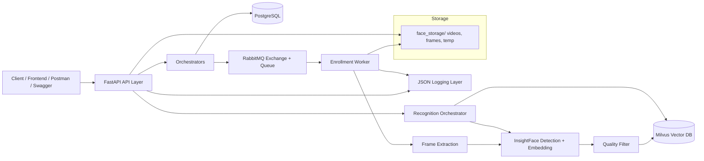

## Containerized deployment architecture

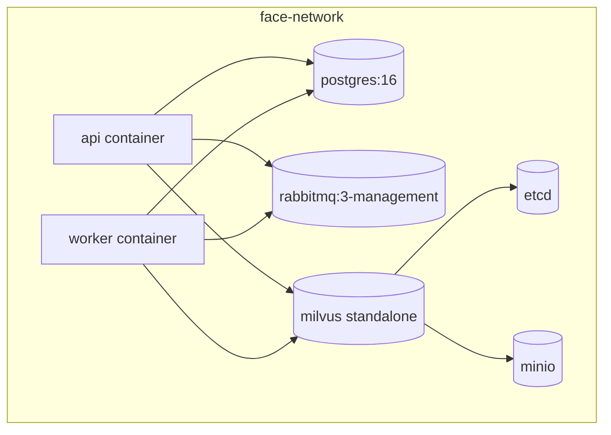

## Data flow architecture

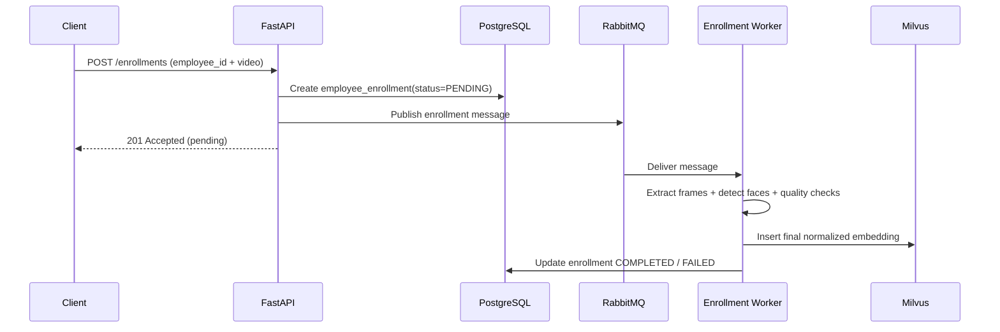

---

# 6. Complete Project Workflow

## End-to-end operational workflow

1. Employee record is created with status PENDING.
2. Enrollment video is uploaded for the employee.
3. Enrollment metadata is persisted in PostgreSQL as PENDING.
4. Enrollment event is published to RabbitMQ queue employee_enrollment.
5. Enrollment worker consumes the message.
6. Worker marks enrollment as PROCESSING.
7. Video is sampled into frames (approximately one frame per second).
8. InsightFace detects faces in each frame.
9. Largest face is selected from frame detections.
10. Face quality checks validate confidence, face size, brightness, pose, and face count.
11. Valid frame embeddings are aggregated and normalized.
12. Final embedding is inserted into Milvus collection.
13. Enrollment is marked COMPLETED and employee status is updated.
14. Temporary files are cleaned based on retention configuration.
15. Recognition requests can now match incoming images to enrolled vectors.
16. Future phase: successful recognition events are mapped into attendance records.

## Workflow visualization

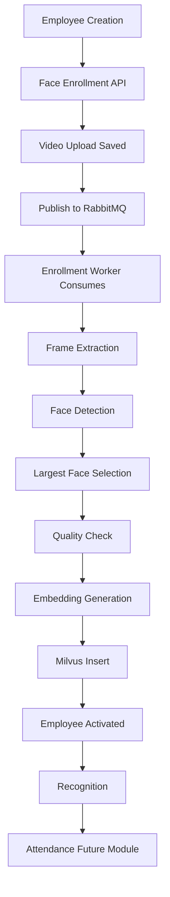

---

# 7. Module Wise Explanation

## 7.1 Employee Module

### Purpose

Manage employee master data and identity metadata required for enrollment and recognition enrichment.

### Responsibilities

- Maintain employee lifecycle metadata.
- Enforce employee_code uniqueness.
- Support filtered retrieval by organization dimensions.
- Expose clean response models for clients.

### Folder structure

- app/models/employee.py
- app/repositories/employee_repo.py
- app/orchestrators/employee_orchestrator.py
- app/api/v1/endpoints/employee.py
- app/schemas/employee.py

### Business logic

- Employee creation defaults to employment_status PENDING.
- Duplicate employee_code results in HTTP 409.
- Query operations support hierarchical org filters.

### Database tables

- employees

### API endpoints

- POST /api/v1/employees
- GET /api/v1/employees
- GET /api/v1/employees/{employee_id}
- PUT /api/v1/employees/{employee_id}
- DELETE /api/v1/employees/{employee_id}
- GET /api/v1/employees/code/{employee_code}
- GET /api/v1/employees/department/{department_id}
- GET /api/v1/employees/shift/{shift_id}
- GET /api/v1/employees/status/{employment_status}

### Relationships

- Many employees belong to one department.
- Many employees belong to one shift.
- One employee can have many enrollment records.

## 7.2 Enrollment Module

### Purpose

Handle enrollment input ingestion, queue dispatch, processing status tracking, and retry workflows.

### Responsibilities

- Accept employee enrollment video uploads.
- Validate employee existence and pending-state constraints.
- Create employee_enrollments record.
- Publish message to RabbitMQ.
- Enable retries for failed enrollments.

### Folder structure

- app/models/employee_enrollment.py
- app/repositories/enrollment_repo.py
- app/orchestrators/enrollment_orchestrator.py
- app/orchestrators/enrollment_processing_orchestrator.py
- app/api/v1/endpoints/enrollment.py
- app/workers/enrollment_worker.py
- app/schemas/enrollment.py

### Business logic

- A pending enrollment for same employee blocks new start request.
- Worker marks PROCESSING, then COMPLETED or FAILED.
- Failed enrollment captures error_message.

### Database tables

- employee_enrollments

### API endpoints

- POST /api/v1/enrollments
- GET /api/v1/enrollments
- GET /api/v1/enrollments/{enrollment_id}
- GET /api/v1/enrollments/employee/{employee_id}
- POST /api/v1/enrollments/{enrollment_id}/retry

### Relationships

- Each enrollment belongs to one employee.
- Multiple enrollments can represent re-enrollment history.

## 7.3 Recognition Module

### Purpose

Perform AI-based face recognition from image upload, then enrich matched identity with employee metadata.

### Responsibilities

- Validate image request.
- Detect and quality-check face candidates.
- Normalize embedding and perform Milvus nearest search.
- Apply similarity threshold and build structured response.

### Folder structure

- app/services/recognition_service.py
- app/orchestrators/recognition_orchestrator.py
- app/api/v1/endpoints/recognition.py
- app/schemas/recognition.py

### Business logic

- Non-image uploads rejected with HTTP 400.
- Unknown faces return matched=false.
- Similarity threshold currently hard-coded at 0.60 in service.

### Database tables

- Does not directly write to relational tables in current phase.

### API endpoints

- POST /api/v1/recognition/image

### Relationships

- Depends on Milvus vectors generated from Enrollment Module.
- Uses employee table for metadata enrichment.

## 7.4 Department Module

### Purpose

Manage organizational department metadata used by employee profiles.

### Responsibilities

- CRUD operations.
- Name uniqueness enforcement.

### Folder structure

- app/models/department.py
- app/repositories/department_repo.py
- app/orchestrators/department_orchestrator.py
- app/api/v1/endpoints/department.py
- app/schemas/department.py

### Database tables

- departments

### API endpoints

- POST /api/v1/departments
- GET /api/v1/departments
- GET /api/v1/departments/{department_id}
- PUT /api/v1/departments/{department_id}
- DELETE /api/v1/departments/{department_id}

## 7.5 Shift Module

### Purpose

Model shift definitions for schedule-aware attendance and reporting.

### Responsibilities

- CRUD for shift definitions.
- Grace window configuration.

### Folder structure

- app/models/shift.py
- app/repositories/shift_repo.py
- app/orchestrators/shift_orchestrator.py
- app/api/v1/endpoints/shift.py
- app/schemas/shift.py

### Database tables

- shifts

### API endpoints

- POST /api/v1/shifts
- GET /api/v1/shifts
- GET /api/v1/shifts/{shift_id}
- PUT /api/v1/shifts/{shift_id}
- DELETE /api/v1/shifts/{shift_id}

## 7.6 Milvus Module

### Purpose

Provide vector persistence and nearest-neighbor search for face embeddings.

### Responsibilities

- Ensure collection and index initialization.
- Insert/search/delete vector records.
- Expose administrative and health operations.

### Folder structure

- app/services/milvus_service.py
- app/orchestrators/milvus_admin_orchestrator.py
- app/api/v1/endpoints/milvus_admin.py

### Business logic

- Embeddings normalized and validated before insert/search.
- Collection schema includes employee_id and employee_code payload.
- HNSW index parameters are configured in service layer.

### API endpoints

- GET /api/v1/milvus/count
- GET /api/v1/milvus/employees
- GET /api/v1/milvus/employee/{employee_id}
- GET /api/v1/milvus/employee/code/{employee_code}
- GET /api/v1/milvus/info
- GET /api/v1/milvus/config
- GET /api/v1/milvus/health
- DELETE /api/v1/milvus/employee/{employee_id}
- DELETE /api/v1/milvus/all

## 7.7 Worker Module

### Purpose

Execute long-running AI processing asynchronously and reliably outside request/response lifecycle.

### Responsibilities

- RabbitMQ consume loop.
- Message parse and validation.
- Explicit ack/nack semantics.
- Retry-safe processing boundary with cleanup in finally block.

### Folder structure

- app/workers/enrollment_worker.py
- app/workers/recognition_worker.py (future placeholder)
- app/workers/attendance_worker.py (future placeholder)
- app/workers/camera_worker.py (future placeholder)

### Relationships

- Receives messages from Enrollment API producer.
- Updates PostgreSQL and Milvus.
- Emits structured logs for operations.

## 7.8 Configuration Module

### Purpose

Centralize environment-driven runtime configuration using typed settings.

### Responsibilities

- Validate startup configuration.
- Provide defaults for optional tuning values.
- Derive DATABASE_URL via computed field.

### Folder structure

- app/core/config.py

## 7.9 Logging Module

### Purpose

Provide consistent structured logs for API and worker components.

### Responsibilities

- JSON log formatting.
- Context injection (request_id, service, environment).
- Rotating application and error log files.

### Folder structure

- app/core/logger.py
- app/core/json_formatter.py
- app/core/context.py

## 7.10 Future Attendance Module

### Purpose

Convert recognition events into auditable attendance records aligned to shift policies.

### Planned responsibilities

- Check-in/check-out policies.
- Grace windows and late mark logic.
- Duplicate event suppression.
- Day-boundary calculations.
- HR/payroll integration exports.

---

# 8. Project Folder Structure

## Complete repository tree

```text
face-recognition-attendance-system/
├── alembic.ini
├── docker-compose.yml
├── docker-compose.dev.yml
├── docker-compose.prod.yml
├── Dockerfile
├── requirements.txt
├── project.txt
├── README.md
├── app/
│   ├── main.py
│   ├── api/
│   │   └── v1/
│   │       ├── router.py
│   │       └── endpoints/
│   │           ├── employee.py
│   │           ├── enrollment.py
│   │           ├── recognition.py
│   │           ├── department.py
│   │           ├── shift.py
│   │           ├── milvus_admin.py
│   │           ├── attendance.py
│   │           ├── camera.py
│   │           ├── access_control.py
│   │           └── visitor.py
│   ├── core/
│   │   ├── config.py
│   │   ├── constants.py
│   │   ├── context.py
│   │   ├── database.py
│   │   ├── json_formatter.py
│   │   ├── logger.py
│   │   ├── metrics.py
│   │   ├── security.py
│   │   └── startup.py
│   ├── enums/
│   │   ├── employee_status.py
│   │   └── enrollment_status.py
│   ├── exceptions/
│   │   ├── embedding_exception.py
│   │   └── milvus_exception.py
│   ├── infrastructure/
│   │   ├── messaging/
│   │   └── storage/
│   ├── models/
│   │   ├── base.py
│   │   ├── employee.py
│   │   ├── employee_enrollment.py
│   │   ├── department.py
│   │   ├── shift.py
│   │   ├── attendance.py
│   │   ├── access_log.py
│   │   ├── face_profile.py
│   │   ├── camera.py
│   │   └── visitor.py
│   ├── modules/
│   │   ├── employee/
│   │   └── enrollment/
│   ├── orchestrators/
│   │   ├── base_orchestrator.py
│   │   ├── employee_orchestrator.py
│   │   ├── enrollment_orchestrator.py
│   │   ├── enrollment_processing_orchestrator.py
│   │   ├── recognition_orchestrator.py
│   │   ├── department_orchestrator.py
│   │   ├── shift_orchestrator.py
│   │   └── milvus_admin_orchestrator.py
│   ├── repositories/
│   │   ├── employee_repo.py
│   │   ├── enrollment_repo.py
│   │   ├── department_repo.py
│   │   ├── shift_repo.py
│   │   ├── attendance_repo.py
│   │   ├── access_repo.py
│   │   ├── camera_repo.py
│   │   └── visitor_repo.py
│   ├── schemas/
│   │   ├── employee.py
│   │   ├── enrollment.py
│   │   ├── recognition.py
│   │   ├── department.py
│   │   ├── shift.py
│   │   ├── attendance.py
│   │   ├── camera.py
│   │   ├── visitor.py
│   │   ├── face.py
│   │   └── pipeline/
│   ├── services/
│   │   ├── employee_service.py
│   │   ├── enrollment_service.py
│   │   ├── frame_extraction_service.py
│   │   ├── insightface_service.py
│   │   ├── face_quality_service.py
│   │   ├── embedding_service.py
│   │   ├── recognition_service.py
│   │   ├── milvus_service.py
│   │   ├── rabbitmq_service.py
│   │   ├── cleanup_service.py
│   │   ├── attendance_service.py
│   │   ├── camera_service.py
│   │   ├── shift_service.py
│   │   ├── visitor_service.py
│   │   └── redis_cache.py
│   ├── utils/
│   │   ├── file_handler.py
│   │   ├── image_utils.py
│   │   └── face_utils.py
│   └── workers/
│       ├── enrollment_worker.py
│       ├── recognition_worker.py
│       ├── attendance_worker.py
│       └── camera_worker.py
├── database/
│   └── migrations/
│       ├── env.py
│       └── versions/
├── face_storage/
│   ├── employees/
│   ├── frames/
│   └── uploads/
├── logs/
├── tests/
└── uploads/
```

## Directory purposes

| Directory | Purpose |
|---|---|
| app/api | HTTP routing and endpoint definitions |
| app/core | Cross-cutting concerns: config, DB engine, logging, startup initialization |
| app/models | SQLAlchemy ORM entities |
| app/repositories | Data access patterns and persistence operations |
| app/orchestrators | Business workflow orchestration across services and repositories |
| app/services | Domain and infrastructure services (AI, queue, vector DB, file management) |
| app/workers | Async message consumers for non-blocking processing |
| app/schemas | Pydantic request/response and pipeline DTOs |
| app/utils | Reusable utility functions (file and image helpers) |
| database/migrations | Alembic migration history and upgrade scripts |
| face_storage | Durable/local filesystem artifacts during enrollment |
| logs | Rotating JSON logs for application and errors |
| tests | Unit and integration test suite scaffold |

---

# 9. Technology Stack

| Technology | Purpose | Version |
|---|---|---|
| Python | Core language runtime | 3.11 |
| FastAPI | High-performance API framework | 0.138.0 |
| Uvicorn | ASGI server | 0.49.0 |
| PostgreSQL | Relational master data and workflow state | 16 (Docker image) |
| SQLAlchemy | ORM and persistence layer | 2.0.51 |
| Alembic | Schema migrations | 1.18.4 |
| RabbitMQ | Message broker for async pipeline | 3-management image |
| Pika | RabbitMQ Python client | 1.4.1 |
| Milvus | Vector database for embeddings | v2.4.4 (container), pymilvus 3.0.0 |
| InsightFace | Face detection and embedding generation | 1.0.1 |
| ONNX Runtime | AI inference backend | 1.23.2 |
| OpenCV | Video frame extraction and image IO | 4.13.0.92 |
| NumPy | Numerical processing and vector math | 2.2.6 |
| Pydantic v2 | Data validation and typed schemas | 2.13.4 |
| pydantic-settings | Environment-driven settings management | 2.14.2 |
| Docker | Containerization | Engine dependent |
| Docker Compose | Multi-service local/prod orchestration | 3.9 spec |
| MinIO | Milvus object storage dependency | RELEASE.2023-03-20 |
| ETCD | Milvus metadata/state dependency | v3.5.5 |

---

# 10. Database Design

## Entity relationship overview

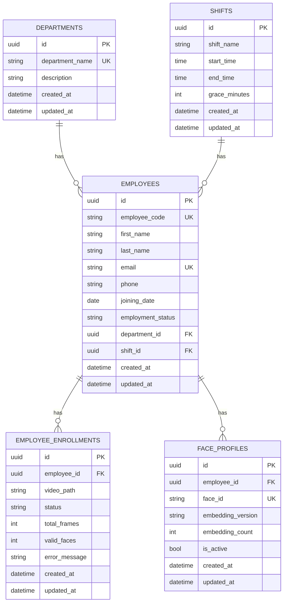

## Table: employees

### Purpose

Primary identity record for personnel used by enrollment and recognition workflows.

### Columns

| Column | Type | Nullable | Notes |
|---|---|---|---|
| id | UUID | No | Primary key |
| employee_code | VARCHAR(50) | No | Unique business key, indexed |
| first_name | VARCHAR(100) | No | Required |
| last_name | VARCHAR(100) | Yes | Optional |
| email | VARCHAR(255) | Yes | Unique when present |
| phone | VARCHAR(20) | Yes | Optional |
| joining_date | DATE | Yes | Employment metadata |
| employment_status | VARCHAR(50) | No | PENDING, ACTIVE, INACTIVE states |
| department_id | UUID | Yes | FK to departments.id |
| shift_id | UUID | Yes | FK to shifts.id |
| created_at | TIMESTAMPTZ | Yes | Server default now() |
| updated_at | TIMESTAMPTZ | Yes | Auto-updated |

### Relationships

- many-to-one with departments.
- many-to-one with shifts.
- one-to-many with employee_enrollments.

### Constraints

- PRIMARY KEY(id)
- UNIQUE(employee_code)
- UNIQUE(email)
- FK(department_id -> departments.id)
- FK(shift_id -> shifts.id)

### Indexes

- ix_employees_employee_code (unique)

## Table: employee_enrollments

### Purpose

Tracks each enrollment processing attempt and asynchronous status history.

### Columns

| Column | Type | Nullable | Notes |
|---|---|---|---|
| id | UUID | No | Primary key |
| employee_id | UUID | No | FK to employees.id |
| video_path | VARCHAR(500) | No | Stored upload path |
| status | VARCHAR(50) | No | PENDING, PROCESSING, COMPLETED, FAILED |
| total_frames | INTEGER | Yes | Reserved for metrics |
| valid_faces | INTEGER | Yes | Reserved for metrics |
| error_message | VARCHAR(1000) | Yes | Failure reason |
| created_at | TIMESTAMPTZ | Yes | Server default now() |
| updated_at | TIMESTAMPTZ | Yes | Auto-updated |

### Relationships

- many-to-one with employees.

### Constraints

- PRIMARY KEY(id)
- FK(employee_id -> employees.id)

### Indexes

- Recommended future index: (employee_id, status)

## Table: departments

### Purpose

Organization taxonomy for employee grouping and reporting.

### Columns

| Column | Type | Nullable | Notes |
|---|---|---|---|
| id | UUID | No | Primary key |
| department_name | VARCHAR(255) | No | Unique |
| description | VARCHAR(500) | Yes | Optional |
| created_at | TIMESTAMPTZ | Yes | Server default now() |
| updated_at | TIMESTAMPTZ | Yes | Auto-updated |

### Constraints

- PRIMARY KEY(id)
- UNIQUE(department_name)

## Table: shifts

### Purpose

Define duty intervals and grace policy foundations for attendance calculations.

### Columns

| Column | Type | Nullable | Notes |
|---|---|---|---|
| id | UUID | No | Primary key |
| shift_name | VARCHAR(100) | Yes | Shift label |
| start_time | TIME | Yes | Shift start |
| end_time | TIME | Yes | Shift end |
| grace_minutes | INTEGER | Yes | Late tolerance |
| created_at | TIMESTAMPTZ | Yes | Server default now() |
| updated_at | TIMESTAMPTZ | Yes | Auto-updated |

### Constraints

- PRIMARY KEY(id)

## Future table: attendance

### Purpose

Persist identity-confirmed attendance events with policy evaluation outputs.

### Proposed columns

- id (UUID PK)
- employee_id (UUID FK)
- recognized_at (TIMESTAMPTZ)
- attendance_date (DATE)
- check_in_at (TIMESTAMPTZ)
- check_out_at (TIMESTAMPTZ)
- shift_id (UUID FK)
- status (ON_TIME, LATE, ABSENT, HALF_DAY)
- source (API_IMAGE, LIVE_CAMERA, BULK_IMPORT)
- confidence_score (FLOAT)
- created_at, updated_at

### Proposed indexes

- unique(employee_id, attendance_date)
- index(attendance_date)
- index(shift_id, attendance_date)

---

# 11. API Documentation

> Base URL prefix: /api/v1

## 11.1 Employee APIs

| Method | URL | Purpose | Request | Response | Status Codes | Business Logic |
|---|---|---|---|---|---|---|
| POST | /employees | Create employee | EmployeeCreateRequest JSON | EmployeeResponse | 201, 409, 422 | Enforces unique employee_code |
| GET | /employees | List all employees | None | EmployeeResponse[] | 200 | Returns all records |
| GET | /employees/{employee_id} | Get employee by id | Path UUID | EmployeeResponse | 200, 404 | Fails if id not found |
| PUT | /employees/{employee_id} | Update employee | EmployeeUpdateRequest JSON | EmployeeResponse | 200, 404, 422 | Updates mutable profile fields |
| DELETE | /employees/{employee_id} | Delete employee | Path UUID | Empty | 204, 404 | Removes employee record |
| GET | /employees/code/{employee_code} | Lookup by employee code | Path string | EmployeeResponse | 200, 404 | Business key lookup |
| GET | /employees/department/{department_id} | Filter by department | Path UUID | EmployeeResponse[] | 200 | Org-scoped listing |
| GET | /employees/shift/{shift_id} | Filter by shift | Path UUID | EmployeeResponse[] | 200 | Schedule-scoped listing |
| GET | /employees/status/{employment_status} | Filter by status | Path string | EmployeeResponse[] | 200 | Lifecycle status query |

## 11.2 Enrollment APIs

| Method | URL | Purpose | Request | Response | Status Codes | Business Logic |
|---|---|---|---|---|---|---|
| POST | /enrollments | Start enrollment | multipart/form-data: employee_id, video_file | {employee_id,enrollment_id,status} | 201, 404, 409, 422 | Saves video, creates PENDING enrollment, publishes RabbitMQ message |
| GET | /enrollments | List enrollments | None | EnrollmentResponse[] | 200 | Returns all enrollment records |
| GET | /enrollments/{enrollment_id} | Enrollment detail | Path UUID | EnrollmentResponse | 200, 404 | Returns single attempt |
| GET | /enrollments/employee/{employee_id} | Employee enrollment history | Path UUID | EnrollmentResponse[] | 200 | Useful for audit and retry UI |
| POST | /enrollments/{enrollment_id}/retry | Retry failed enrollment | Path UUID | {message,enrollment_id,status} | 200, 404 | Resets status to PENDING and republishes message |

## 11.3 Recognition APIs

| Method | URL | Purpose | Request | Response | Status Codes | Business Logic |
|---|---|---|---|---|---|---|
| POST | /recognition/image | Recognize face(s) from uploaded image | multipart/form-data: file | RecognitionResponse | 200, 400, 500 | Validates file type and decode, performs quality-filtered vector matching |

## 11.4 Department APIs

| Method | URL | Purpose | Request | Response | Status Codes | Business Logic |
|---|---|---|---|---|---|---|
| POST | /departments | Create department | DepartmentCreate JSON | DepartmentResponse | 201, 409, 422 | Enforces unique department_name |
| GET | /departments | List departments | None | DepartmentResponse[] | 200 | Returns all departments |
| GET | /departments/{department_id} | Get department by id | Path UUID | DepartmentResponse | 200, 404 | Not found handling |
| PUT | /departments/{department_id} | Update department | DepartmentUpdate JSON | DepartmentResponse | 200, 404, 422 | Edits name/description |
| DELETE | /departments/{department_id} | Delete department | Path UUID | Empty | 204, 404 | Deletes existing department |

## 11.5 Shift APIs

| Method | URL | Purpose | Request | Response | Status Codes | Business Logic |
|---|---|---|---|---|---|---|
| POST | /shifts | Create shift | ShiftCreate JSON | ShiftResponse | 201, 409, 422 | Enforces shift name uniqueness |
| GET | /shifts | List shifts | None | ShiftResponse[] | 200 | Returns all shifts |
| GET | /shifts/{shift_id} | Get shift by id | Path UUID | ShiftResponse | 200, 404 | Not found handling |
| PUT | /shifts/{shift_id} | Update shift | ShiftUpdate JSON | ShiftResponse | 200, 404, 422 | Updates shift attributes |
| DELETE | /shifts/{shift_id} | Delete shift | Path UUID | Empty | 204, 404 | Deletes shift |

## 11.6 Milvus APIs

| Method | URL | Purpose | Request | Response | Status Codes | Business Logic |
|---|---|---|---|---|---|---|
| GET | /milvus/count | Count vectors | None | {total_vectors} | 200, 500 | Queries all vector rows |
| GET | /milvus/employees | List vector payloads | None | list | 200, 500 | Returns employee_id and employee_code records |
| GET | /milvus/employee/{employee_id} | Lookup vector by employee id | Path string | dict | 200, 404, 500 | Admin debug and validation |
| GET | /milvus/employee/code/{employee_code} | Lookup vector by employee code | Path string | dict | 200, 404, 500 | Admin debug and validation |
| GET | /milvus/info | Collection stats | None | dict | 200, 500 | Returns collection info |
| GET | /milvus/config | Index configuration | None | dict | 200, 500 | Returns metric/index/dimension config |
| GET | /milvus/health | Health check | None | dict | 200 | Returns UP or DOWN state |
| DELETE | /milvus/employee/{employee_id} | Delete one vector | Path string | {message} | 200, 500 | Deletes vector by employee_id |
| DELETE | /milvus/all | Delete all vectors | None | {message} | 200, 500 | Administrative bulk destructive operation |

## 11.7 API Request and Response Examples

### Employee - Create employee

Request:

```http
POST /api/v1/employees
Content-Type: application/json

{
	"employee_code": "EMP001",
	"first_name": "Vijay",
	"last_name": "Rajput",
	"email": "vijay.rajput@example.com",
	"phone": "+91-9999999999",
	"joining_date": "2026-07-01",
	"department_id": "11111111-1111-1111-1111-111111111111",
	"shift_id": "22222222-2222-2222-2222-222222222222"
}
```

Response (201):

```json
{
	"id": "d2d7a1fe-a348-4308-a9cf-d65d9f4088e3",
	"employee_code": "EMP001",
	"first_name": "Vijay",
	"last_name": "Rajput",
	"email": "vijay.rajput@example.com",
	"phone": "+91-9999999999",
	"joining_date": "2026-07-01",
	"department_id": "11111111-1111-1111-1111-111111111111",
	"shift_id": "22222222-2222-2222-2222-222222222222",
	"employment_status": "PENDING"
}
```

### Enrollment - Start enrollment (multipart)

Request:

```bash
curl -X POST "http://localhost:8000/api/v1/enrollments" \
	-F "employee_id=d2d7a1fe-a348-4308-a9cf-d65d9f4088e3" \
	-F "video_file=@sample_enrollment.mp4"
```

Response (201):

```json
{
	"employee_id": "d2d7a1fe-a348-4308-a9cf-d65d9f4088e3",
	"enrollment_id": "9b671605-b7ad-4ea0-a563-5ce5ad58b74c",
	"status": "PENDING"
}
```

### Recognition - Recognize from image

Request:

```bash
curl -X POST "http://localhost:8000/api/v1/recognition/image" \
	-F "file=@face.jpg"
```

Matched response (200):

```json
{
	"total_faces": 1,
	"recognized_faces": [
		{
			"employee_id": "d2d7a1fe-a348-4308-a9cf-d65d9f4088e3",
			"employee_code": "EMP001",
			"distance": 0.82,
			"matched": true,
			"bbox": [120, 88, 282, 290],
			"employee": {
				"id": "d2d7a1fe-a348-4308-a9cf-d65d9f4088e3",
				"employee_code": "EMP001",
				"first_name": "Vijay",
				"last_name": "Rajput",
				"email": "vijay.rajput@example.com",
				"phone": "+91-9999999999"
			}
		}
	]
}
```

Unknown face response (200):

```json
{
	"total_faces": 1,
	"recognized_faces": [
		{
			"employee_id": null,
			"employee_code": null,
			"distance": 0.41,
			"matched": false,
			"bbox": [106, 74, 270, 278],
			"employee": null
		}
	]
}
```

### Department - Create

Request:

```http
POST /api/v1/departments
Content-Type: application/json

{
	"department_name": "AI/ML",
	"description": "Artificial Intelligence and Machine Learning"
}
```

Response (201):

```json
{
	"id": "b2b1ff2f-8efd-4778-a72a-043f5984d7d7",
	"department_name": "AI/ML",
	"description": "Artificial Intelligence and Machine Learning"
}
```

### Shift - Create

Request:

```http
POST /api/v1/shifts
Content-Type: application/json

{
	"shift_name": "General Shift",
	"start_time": "09:00:00",
	"end_time": "18:00:00",
	"grace_minutes": 15
}
```

Response (201):

```json
{
	"id": "76e2d976-7418-490f-b8f1-2de1188eeaa3",
	"shift_name": "General Shift",
	"start_time": "09:00:00",
	"end_time": "18:00:00",
	"grace_minutes": 15
}
```

### Milvus - Health check

Request:

```http
GET /api/v1/milvus/health
```

Response (200):

```json
{
	"status": "UP",
	"connected": true,
	"collection": "employee_face_embeddings",
	"row_count": 12,
	"index_type": "HNSW",
	"metric_type": "COSINE",
	"dimension": 512
}
```

---

# 12. API Flow Diagrams

## Employee creation flow

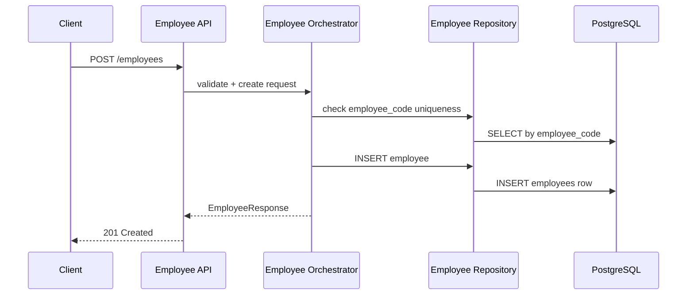

## Enrollment flow

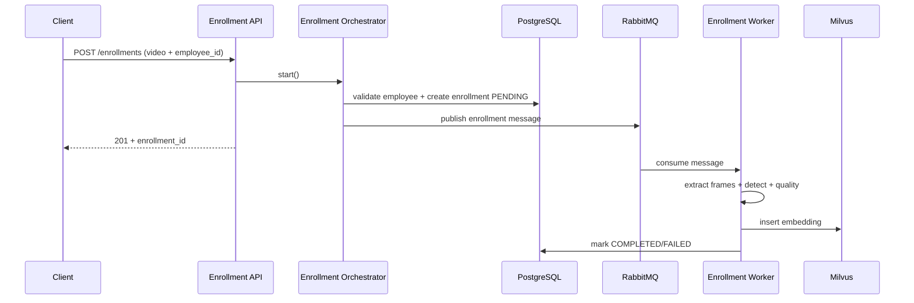

## Recognition flow

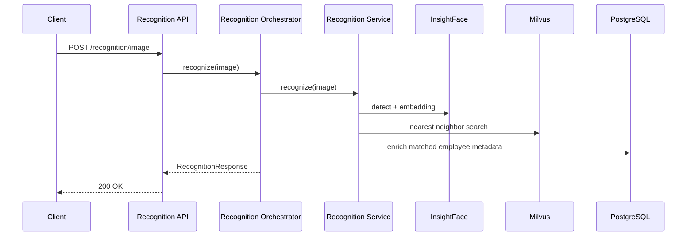

## Attendance flow (future)

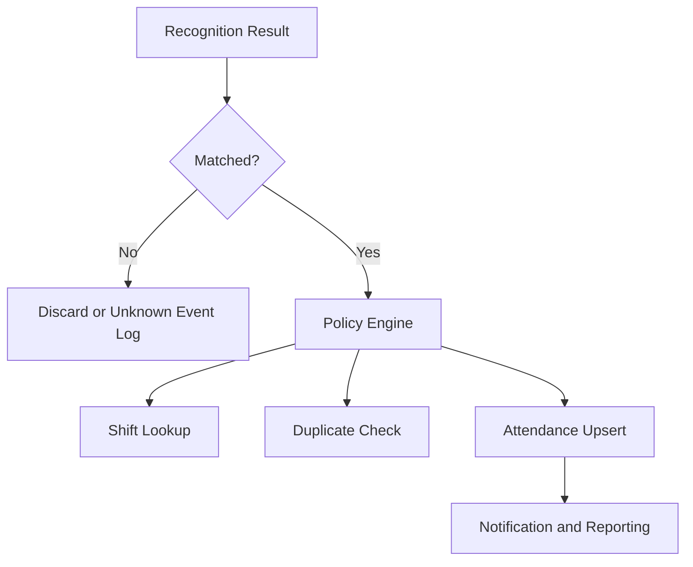

---

# 13. RabbitMQ Architecture

## Core concepts in this project

| Component | Implementation |
|---|---|
| Exchange | Direct exchange configured via RABBITMQ_EXCHANGE (default employee) |
| Routing key | Queue name (employee_enrollment) |
| Producer | Enrollment orchestrator publishes EnrollmentMessage |
| Consumer | enrollment_worker callback consumes, validates, and processes |
| Acknowledgement | basic_ack on success |
| Negative acknowledgement | basic_nack(requeue=false) on failure |
| Retry | Publisher connection retry + reconnect; business retry endpoint for failed enrollment |
| Dead Letter Queue | Planned future enhancement |

## RabbitMQ message flow diagram

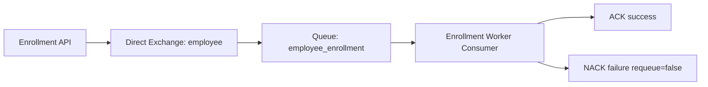

## Message schema

```json
{
  "employee_id": "uuid-string",
  "employee_code": "EMP001",
  "enrollment_id": "uuid-string",
  "video_path": "face_storage/employees/EMP001/enrollment.mp4"
}
```

## Reliability strategy

- Durable queue/exchange declarations.
- Prefetch count set to 1 for controlled worker load.
- Thread-aware RabbitMQ singleton client with reconnect support.
- Retry behavior for transient connection/channel errors.
- Explicit consumer ack/nack behavior to prevent silent drops.

## Dead letter strategy (future)

Planned improvements:

- Dead letter exchange and queue for failed messages.
- Retry delay queue with exponential backoff.
- Poison message quarantine and manual replay tooling.

---

# 14. Milvus Architecture

## Collection design

| Field | Type | Description |
|---|---|---|
| id | INT64 (auto id) | Milvus internal primary key |
| employee_id | VARCHAR(100) | Business identity linkage |
| employee_code | VARCHAR(100) | Human-readable identity key |
| embedding | FLOAT_VECTOR(dim=MILVUS_DIMENSION) | Normalized facial vector |

## Index configuration

| Parameter | Value Source |
|---|---|
| Collection name | MILVUS_COLLECTION |
| Embedding dimension | MILVUS_DIMENSION |
| Metric type | MILVUS_METRIC_TYPE |
| Index type | MILVUS_INDEX_TYPE |
| HNSW M | 16 |
| HNSW efConstruction | 200 |

## Insert flow

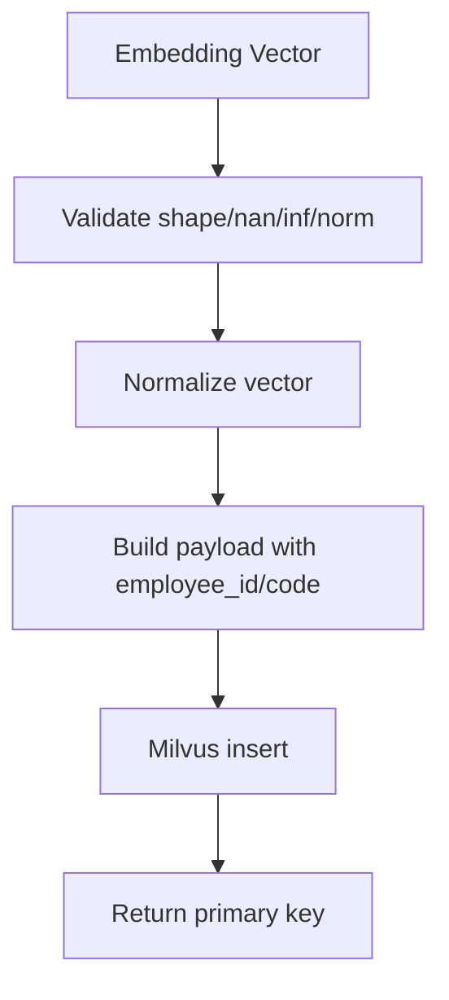

## Search flow

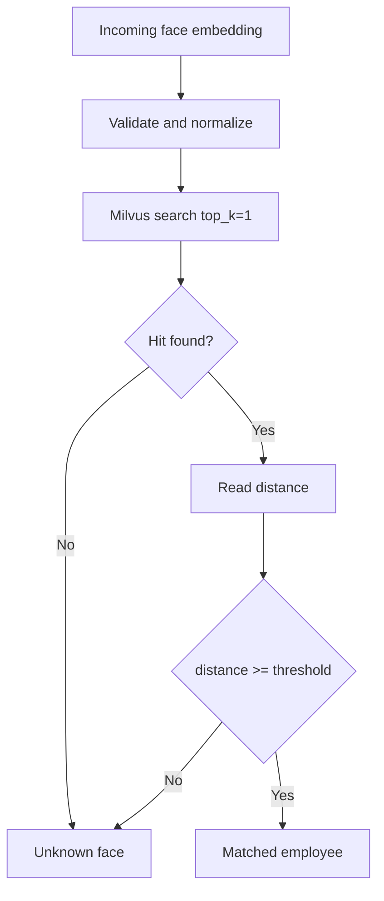

## Operational notes

- Service initializes collection and index if absent.
- Collection is loaded during initialization.
- Admin APIs expose count/info/config/health and destructive cleanup operations.

---

# 15. Face Recognition Pipeline

## Pipeline stages

### 1. Video upload

Enrollment API accepts multipart upload and stores file under employee-specific directory.

### 2. Frame extraction

Video is sampled approximately once per second based on FPS; frames are persisted as JPGs.

### 3. Face detection

InsightFace detects faces and generates per-face embeddings and landmarks.

### 4. Largest face selection

When detections exist, the largest face area is selected for each frame to reduce background/noise impact.

### 5. Quality check

Frame is accepted only if all quality checks pass:

- Single face presence.
- Minimum detection confidence.
- Minimum width/height.
- Brightness range.
- Pose angles within thresholds.

### 6. Embedding generation

Accepted frame embeddings are aggregated (mean) and normalized to produce final enrollment embedding.

### 7. Milvus search / insert

- Enrollment uses insert into Milvus.
- Recognition uses search against existing vectors.

### 8. Recognition result

Result includes matched state, vector distance, bounding box, and optional enriched employee profile.

## Pipeline diagram


---

# 16. Configuration

## Environment variable specification

> Create a .env file in the project root. Values below include defaults inferred from code where available.

### 16.1 Application

| Variable | Description | Default | Required | Example |
|---|---|---|---|---|
| APP_NAME | Application display name | face-recognition-system | No | face-recognition-system |
| APP_ENV | Runtime environment tag | development | No | production |
| DEBUG | Debug behavior | true | No | false |

### 16.2 API

| Variable | Description | Default | Required | Example |
|---|---|---|---|---|
| API_TITLE | API title metadata | Face Recognition System | No | Face Recognition System |
| API_VERSION | API semantic version | 1.0.0 | No | 1.0.0 |
| API_PREFIX | API route prefix | /api/v1 | No | /api/v1 |

### 16.3 Database

| Variable | Description | Default | Required | Example |
|---|---|---|---|---|
| POSTGRES_HOST | PostgreSQL host | None | Yes | localhost |
| POSTGRES_PORT | PostgreSQL port | None | Yes | 5432 |
| POSTGRES_DB | Database name | None | Yes | attendance_db |
| POSTGRES_USER | Database user | None | Yes | postgres |
| POSTGRES_PASSWORD | Database password | None | Yes | postgres |

### 16.4 RabbitMQ

| Variable | Description | Default | Required | Example |
|---|---|---|---|---|
| RABBITMQ_HOST | RabbitMQ broker host | None | Yes | localhost |
| RABBITMQ_PORT | RabbitMQ broker port | None | Yes | 5672 |
| RABBITMQ_USER | RabbitMQ username | None | Yes | guest |
| RABBITMQ_PASSWORD | RabbitMQ password | None | Yes | guest |
| RABBITMQ_VHOST | Virtual host | / | No | / |
| RABBITMQ_HEARTBEAT | Connection heartbeat seconds | 600 | No | 600 |
| RABBITMQ_BLOCKED_TIMEOUT | Blocked timeout seconds | 300 | No | 300 |
| RABBITMQ_EXCHANGE | Exchange name | employee | No | employee |
| RABBITMQ_USE_SSL | Optional SSL enable (read via getattr) | false | No | true |
| RABBITMQ_CONNECT_MAX_RETRIES | Optional connect retries | 5 | No | 8 |
| RABBITMQ_CONNECT_BACKOFF_BASE | Optional base backoff seconds | 0.5 | No | 1.0 |
| RABBITMQ_CONNECT_BACKOFF_MAX | Optional max backoff seconds | 10.0 | No | 15.0 |
| RABBITMQ_PUBLISH_MAX_RETRIES | Optional publish retries | 2 | No | 5 |

### 16.5 Redis

| Variable | Description | Default | Required | Example |
|---|---|---|---|---|
| REDIS_HOST | Redis host | localhost | No | localhost |
| REDIS_PORT | Redis port | 6379 | No | 6379 |
| REDIS_DB | Redis DB index | 0 | No | 1 |
| REDIS_PASSWORD | Redis password | None | No | strong-password |

### 16.6 Milvus

| Variable | Description | Default | Required | Example |
|---|---|---|---|---|
| MILVUS_URI | Milvus connection URI | None | Yes | http://localhost:19530 |
| MILVUS_COLLECTION | Collection name | None | Yes | employee_face_embeddings |
| MILVUS_DIMENSION | Embedding vector dimension | None | Yes | 512 |
| MILVUS_METRIC_TYPE | Similarity metric | None | Yes | COSINE |
| MILVUS_INDEX_TYPE | Index type | None | Yes | HNSW |
| MILVUS_USERNAME | Milvus username | None | No | root |
| MILVUS_PASSWORD | Milvus password | None | No | Milvus |

### 16.7 InsightFace

| Variable | Description | Default | Required | Example |
|---|---|---|---|---|
| INSIGHTFACE_MODEL_NAME | Model package | buffalo_l | No | buffalo_l |
| INSIGHTFACE_GPU_ID | GPU device id (-1 for CPU in docker override) | 0 | No | -1 |
| INSIGHTFACE_DET_SIZE | Detection image size | 640 | No | 640 |
| INSIGHTFACE_DETECTION_THRESHOLD | Detection confidence floor | 0.60 | No | 0.65 |
| INSIGHTFACE_MAX_FACES | Max expected faces | 1 | No | 1 |

### 16.8 Recognition / Quality

| Variable | Description | Default | Required | Example |
|---|---|---|---|---|
| FACE_MIN_CONFIDENCE | Minimum face detector confidence | 0.70 | No | 0.75 |
| FACE_MIN_FACE_WIDTH | Minimum bounding box width | 112 | No | 112 |
| FACE_MIN_FACE_HEIGHT | Minimum bounding box height | 112 | No | 112 |
| FACE_MIN_BRIGHTNESS | Minimum frame brightness | 50 | No | 60 |
| FACE_MAX_BRIGHTNESS | Maximum frame brightness | 220 | No | 210 |
| FACE_MIN_BLUR_SCORE | Blur threshold (currently blur check disabled in code) | 100.0 | No | 120.0 |
| FACE_MAX_YAW | Maximum yaw angle | 20.0 | No | 18.0 |
| FACE_MAX_PITCH | Maximum pitch angle | 20.0 | No | 18.0 |
| FACE_MAX_ROLL | Maximum roll angle | 20.0 | No | 15.0 |

### 16.9 Enrollment / Worker

| Variable | Description | Default | Required | Example |
|---|---|---|---|---|
| WORKER_PREFETCH_COUNT | Consumer prefetch | 1 | No | 1 |
| WORKER_MAX_RETRIES | Worker retry attempts (future policy hook) | 3 | No | 5 |
| WORKER_BATCH_SIZE | Batch size for processing (future optimization) | 32 | No | 64 |

### 16.10 Logging

| Variable | Description | Default | Required | Example |
|---|---|---|---|---|
| LOG_LEVEL | Logging level | INFO | No | DEBUG |
| LOG_STORAGE_PATH | Log directory | logs | No | logs |

### 16.11 Storage

| Variable | Description | Default | Required | Example |
|---|---|---|---|---|
| STORAGE_ROOT | Root storage path | face_storage | No | face_storage |
| UPLOAD_STORAGE_PATH | Uploaded video path | face_storage/uploads | No | face_storage/uploads |
| FRAMES_STORAGE_PATH | Extracted frames path | face_storage/frames | No | face_storage/frames |
| FACES_STORAGE_PATH | Face crops path | face_storage/faces | No | face_storage/faces |
| EMBEDDING_STORAGE_PATH | Embedding files path | face_storage/embeddings | No | face_storage/embeddings |
| TEMP_STORAGE_PATH | Temporary artifacts path | face_storage/temp | No | face_storage/temp |
| FAILED_STORAGE_PATH | Failed artifacts path | face_storage/failed | No | face_storage/failed |
| KEEP_ENROLLMENT_VIDEO | Keep source videos after processing | false | No | true |
| KEEP_EXTRACTED_FRAMES | Keep extracted frames after processing | false | No | true |

### 16.12 Security / Future JWT

| Variable | Description | Default | Required | Example |
|---|---|---|---|---|
| SECRET_KEY | JWT secret key (future auth module) | change-this-secret-key | No | long-random-secret |
| ACCESS_TOKEN_EXPIRE_MINUTES | Token expiry minutes | 60 | No | 30 |
| ALGORITHM | JWT signing algorithm | HS256 | No | HS256 |

### 16.13 Docker / Milvus dependencies

| Variable | Description | Default | Required | Example |
|---|---|---|---|---|
| MINIO_ACCESS_KEY | MinIO access key for Milvus storage | None | Yes in docker compose | minioadmin |
| MINIO_SECRET_KEY | MinIO secret key for Milvus storage | None | Yes in docker compose | minioadmin |

---

# 17. Installation Guide

## 17.1 Clone repository

```bash
git clone <your-repo-url>
cd face-recognition-attendance-system
```

## 17.2 Create virtual environment

### Windows (PowerShell)

```powershell
python -m venv .venv
.\.venv\Scripts\Activate.ps1
```

### Linux / macOS

```bash
python3 -m venv .venv
source .venv/bin/activate
```

## 17.3 Install dependencies

```bash
pip install --upgrade pip
pip install -r requirements.txt
```

## 17.4 Configure environment variables

Create .env file:

```env
POSTGRES_HOST=localhost
POSTGRES_PORT=5432
POSTGRES_DB=attendance_db
POSTGRES_USER=postgres
POSTGRES_PASSWORD=postgres

RABBITMQ_HOST=localhost
RABBITMQ_PORT=5672
RABBITMQ_USER=guest
RABBITMQ_PASSWORD=guest
RABBITMQ_VHOST=/
RABBITMQ_EXCHANGE=employee

MILVUS_URI=http://localhost:19530
MILVUS_COLLECTION=employee_face_embeddings
MILVUS_DIMENSION=512
MILVUS_METRIC_TYPE=COSINE
MILVUS_INDEX_TYPE=HNSW

INSIGHTFACE_GPU_ID=-1
LOG_LEVEL=INFO
APP_ENV=development
APP_NAME=face-recognition-system
MINIO_ACCESS_KEY=minioadmin
MINIO_SECRET_KEY=minioadmin
```

## 17.5 Run Alembic migrations

```bash
alembic upgrade head
```

## 17.6 Start infrastructure

You can either start services manually or use Docker Compose.

Manual service expectations:

- PostgreSQL running and reachable.
- RabbitMQ running and reachable.
- Milvus stack (Milvus + ETCD + MinIO) running.

## 17.7 Start FastAPI

```bash
uvicorn app.main:app --reload
```

## 17.8 Start worker

```bash
python -m app.workers.enrollment_worker
```

---

# 18. Docker Guide

## Docker Compose strategy

This project uses layered compose files:

- docker-compose.yml: base shared services.
- docker-compose.dev.yml: development overrides (ports, mounts, reload).
- docker-compose.prod.yml: production hardening (restart policy, log rotation).

## Development mode

```bash
docker compose -f docker-compose.yml -f docker-compose.dev.yml up --build
```

## Production mode

```bash
docker compose -f docker-compose.yml -f docker-compose.prod.yml up -d --build
```

## Compose service inventory

| Service | Role |
|---|---|
| api | FastAPI HTTP layer + migration boot command |
| worker | Enrollment queue consumer |
| postgres | Relational metadata storage |
| rabbitmq | Messaging broker + management UI |
| etcd | Milvus metadata backend |
| minio | Milvus object storage backend |
| milvus | Vector storage and search engine |

## Volumes

| Volume | Purpose |
|---|---|
| postgres_data | PostgreSQL durable data |
| rabbitmq_data | RabbitMQ durable broker data |
| etcd_data | ETCD metadata durability |
| minio_data | MinIO object data |
| milvus_data | Milvus vector index and segments |

## Networks

| Network | Purpose |
|---|---|
| face-network | Isolated service communication plane |

## Useful Docker commands

```bash
docker compose ps
docker compose logs -f api
docker compose logs -f worker
docker compose restart worker
docker compose down
docker compose down -v
```

---

# 19. Running the Project

## Development mode

### Windows

1. Activate virtual environment.
2. Ensure PostgreSQL, RabbitMQ, and Milvus are reachable.
3. Run migrations.
4. Start API and worker in separate terminals.

```powershell
alembic upgrade head
uvicorn app.main:app --reload
python -m app.workers.enrollment_worker
```

### Linux

```bash
alembic upgrade head
uvicorn app.main:app --reload
python -m app.workers.enrollment_worker
```

## Production mode

Recommended production startup:

```bash
docker compose -f docker-compose.yml -f docker-compose.prod.yml up -d --build
```

Validate runtime health:

- API docs: http://localhost:8000/docs
- RabbitMQ UI: http://localhost:15672
- Milvus endpoint: http://localhost:19530

---

# 20. Testing

## Current testing status

The tests directory is scaffolded and ready for unit/integration growth. The project currently emphasizes manual API and pipeline verification during active development phases.

## API testing

- Swagger UI for interactive endpoint execution.
- Postman collection recommended for scenario suites.

## Swagger testing

1. Start API.
2. Open /docs.
3. Execute endpoint requests with sample payloads.

## Postman testing recommendations

- Environment variables for base URL and dynamic UUIDs.
- Collection folders by module.
- Pre-request scripts for common headers and auth (future).

## Unit testing strategy

Recommended unit test layers:

- Services: quality scoring, embedding validation, threshold logic.
- Repositories: CRUD behavior with test DB.
- Orchestrators: business policy outcomes and exception paths.

## Integration testing strategy

Recommended integration suites:

- Enrollment end-to-end from upload to Milvus insertion.
- Recognition end-to-end from image upload to enriched response.
- RabbitMQ consumer lifecycle and ack/nack outcomes.

## Worker testing strategy

- Inject known message payload and verify DB state transitions.
- Simulate failures and ensure FAILED status + error_message updates.
- Validate cleanup behavior under retention configurations.

## Recognition testing strategy

- Positive match dataset.
- Unknown identity dataset.
- Edge dataset: low light, multi-face, profile angle, blur.

---

# 21. Logging

## Logging architecture

The platform uses a centralized JSON logging subsystem designed for machine parsing and observability pipelines.

### Key characteristics

- Structured JSON logs.
- Service and environment metadata injection.
- request_id context support.
- Rotating file handlers for application and error streams.

## Log fields

| Field | Description |
|---|---|
| timestamp | UTC ISO timestamp |
| level | Log level |
| message | Human-readable message |
| logger | Logger name |
| module/function/line/file | Code location metadata |
| hostname/process/thread | Runtime execution context |
| request_id | Request-scoped correlation id |
| service | Logical service name (api, enrollment-worker, etc.) |
| environment | Environment tag (development/production) |

## Log levels

- DEBUG: Detailed developer diagnostics.
- INFO: Normal operation milestones.
- WARNING: Recoverable anomalies.
- ERROR: Failures requiring attention.

## Log files

- logs/application.log (rotating)
- logs/error.log (rotating)

---

# 22. Error Handling

## Error handling principles

- Fail fast on invalid request shape or media type.
- Preserve business-safe error messages for client responses.
- Record full exception stack in server logs.
- Maintain state consistency in long-running workflows.

## Error categories

| Error Category | Current Handling Pattern |
|---|---|
| Validation errors | FastAPI/Pydantic 422 response |
| Resource not found | HTTP 404 via orchestrators |
| Conflict errors | HTTP 409 for duplicate or invalid workflow state |
| Database errors | Exception logging and rollback at transactional boundaries |
| RabbitMQ errors | Reconnect/retry for transient failures; nack handling in consumer |
| Milvus errors | Logged exceptions with API-level 500 wrappers |
| Recognition errors | HTTP 400 for file/decode validation, 500 for unexpected failures |
| Enrollment errors | Enrollment marked FAILED and employee status adjusted on processing exception |

## Workflow state integrity

Enrollment pipeline uses explicit status transitions:

- PENDING -> PROCESSING -> COMPLETED
- PENDING/PROCESSING -> FAILED (with error message)

---

# 23. Performance Considerations

## Current performance-aware design

- Asynchronous processing decouples API latency from AI workload.
- Worker prefetch control prevents overloading single worker process.
- Singleton service patterns reduce repeated heavy initialization.
- Vector search in Milvus provides scalable similarity lookups.

## Optimization dimensions

### Caching

- Redis integration exists and can cache frequent employee metadata reads.

### Batch processing

- Embedding batch insertion support exists in Milvus service.

### GPU usage

- InsightFace GPU ID configurable.
- Docker override uses CPU mode by default for broad compatibility.

### Async and concurrency

- API layer supports async endpoint style where needed.
- Worker model supports horizontal scaling by running multiple consumers.

### Thread pool and process model

- For CPU-bound workloads, scale by process replicas and queue partitioning.

### Database indexing

- employee_code indexed and unique.
- Add future indexes for high-volume attendance/reporting queries.

### Worker scaling

- Scale worker containers independently from API containers.
- Use queue metrics to drive autoscaling policies.

---

# 24. Security

## Security foundations in current code

- Typed request validation through Pydantic schemas.
- ORM-based data access lowers SQL injection risk.
- File type checks on recognition image uploads.
- Non-root container user in Dockerfile.
- Environment-driven secret injection pattern.

## Security controls by area

| Area | Current State | Next Step |
|---|---|---|
| Input validation | Strong schema validation | Add stricter file content signature checks |
| Authentication | JWT placeholders in config | Implement auth middleware and token issuance |
| Authorization | Not yet enforced | Introduce RBAC roles (Admin, HR, Operator, Viewer) |
| SQL injection prevention | SQLAlchemy ORM | Add query audit and static checks |
| File upload hardening | Basic MIME checks | Add extension whitelist, max size, antivirus scan |
| Secrets handling | Env variables | Integrate secret manager (Vault/KMS) |
| Transport security | Environment dependent | Enforce HTTPS + secure headers in production |

## JWT (future)

Planned JWT module should include:

- Access token issuance and refresh strategy.
- Role claims for endpoint authorization.
- Token revocation and rotation policy.

---

# 25. Deployment

## Local deployment

- Use virtual environment and local dependencies.
- Start infrastructure dependencies.
- Run migrations, API, and worker.

## Docker deployment

- Use compose overlays for consistent environments.
- Run migration command during api startup (already configured).

## Production deployment blueprint

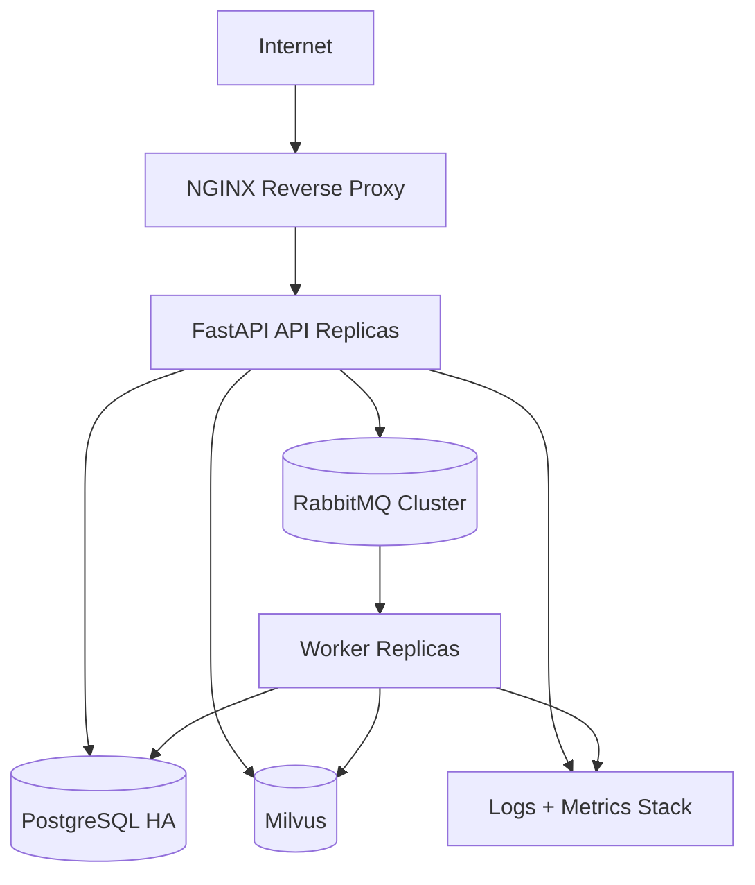

## Reverse proxy and HTTPS

Recommended production controls:

- NGINX or Traefik in front of API service.
- TLS termination with automatic certificate renewals.
- Rate limits and payload size limits.

## Monitoring

Recommended stack:

- Prometheus metrics export (future module).
- Grafana dashboards.
- Centralized logs in ELK or Loki.
- Alerting for queue depth, worker failure, and API error spikes.

---

# 26. Future Roadmap

## Completed

- Employee management APIs.
- Department and shift modules.
- Enrollment queue pipeline.
- Milvus vector insertion/search and admin endpoints.
- Recognition from image upload.
- Dockerized multi-service runtime.

## In progress

- Attendance domain maturation.
- Worker fleet expansion for additional asynchronous workloads.
- Extended operational metrics and SLO instrumentation.

## Planned

| Feature | Description | Priority |
|---|---|---|
| Attendance Engine | Shift-aware attendance state and policy outcomes | High |
| Live Camera Recognition | RTSP/camera ingestion and real-time identification | High |
| Visitor Management | Visitor registration and temporary access identities | Medium |
| Dashboard | Admin web dashboard for operational and HR workflows | Medium |
| Reports | Attendance and exception analytics exports | Medium |
| Authentication | JWT + RBAC for secured APIs | High |
| Notifications | Event-based email/SMS/Slack hooks | Medium |
| Analytics | Recognition quality and drift dashboards | Medium |
| CI/CD | Automated quality gates and release pipeline | High |
| Kubernetes | Container orchestration, autoscaling, and HA deployment | High |

## Timeline-oriented roadmap

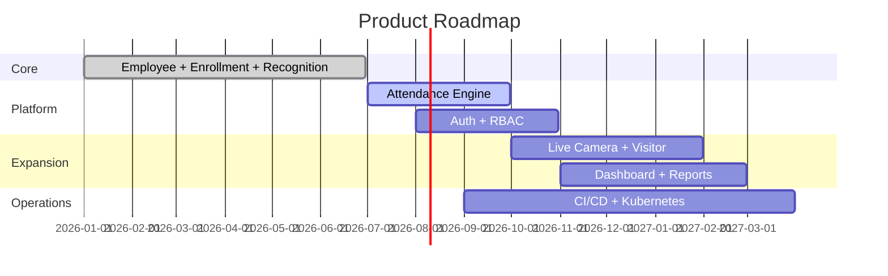

---

# 27. Contributing Guide

## Contribution philosophy

This project welcomes professional, testable, production-minded contributions that preserve modular boundaries and operational reliability.

## Coding standards

- Follow PEP 8 and type-hinted Python style.
- Keep orchestrators business-focused and repositories persistence-focused.
- Prefer explicit error handling and deterministic log context.
- Avoid cross-module tight coupling.

## Folder structure discipline

- API layer should not directly contain heavy business logic.
- Services should remain composable and unit-testable.
- Domain workflows should be orchestrated in orchestrators.

## Commit messages

Use conventional style:

- feat: add attendance policy validator
- fix: handle empty frame list during enrollment
- refactor: split recognition threshold policy
- docs: expand deployment section
- test: add enrollment orchestrator integration tests

## Branch naming

- feature/attendance-engine
- fix/milvus-search-timeout
- refactor/enrollment-state-machine
- docs/readme-architecture-update

## Pull request checklist

- [ ] Code compiles and lints.
- [ ] Tests added/updated where relevant.
- [ ] Backward compatibility assessed.
- [ ] README or docs updated for behavior changes.
- [ ] Migration included for schema changes.
- [ ] Observability implications considered.

## Suggested PR template

```markdown
## Summary

## Why this change

## What changed

## How to test

## Risks and rollback

## Follow-up tasks
```

---

# 28. License

License placeholder.

Replace this section with your chosen OSS license text and include a LICENSE file at repository root.

---

# 29. Authors

Authors placeholder.

Suggested format:

- Name - Role - GitHub profile
- Name - Role - GitHub profile

---

# 30. Acknowledgements

This project stands on the shoulders of the following open-source ecosystems and maintainers:

- FastAPI
- Uvicorn
- SQLAlchemy
- Alembic
- PostgreSQL
- RabbitMQ
- Pika
- Milvus
- pymilvus
- InsightFace
- ONNX Runtime
- OpenCV
- NumPy
- Pydantic
- Docker

Special thanks to the open-source community for maintaining production-grade libraries and infrastructure that make AI system engineering accessible and reliable.

---

# 31. Appendix

## 31.1 Glossary

| Term | Definition |
|---|---|
| Embedding | Numerical vector representation of a face identity |
| Vector DB | Specialized database for similarity search in high-dimensional space |
| Enrollment | Process of registering identity vectors for an employee |
| Recognition | Process of matching incoming face vectors against enrolled vectors |
| Orchestrator | Business workflow layer coordinating services and repositories |
| Repository | Data access abstraction over database operations |
| ACK/NACK | RabbitMQ message success/failure acknowledgement semantics |
| HNSW | Graph-based ANN index algorithm used for vector search |

## 31.2 Useful commands

### Local development

```bash
pip install -r requirements.txt
alembic upgrade head
uvicorn app.main:app --reload
python -m app.workers.enrollment_worker
```

### Docker development

```bash
docker compose -f docker-compose.yml -f docker-compose.dev.yml up --build
docker compose logs -f api
docker compose logs -f worker
```

### Docker production

```bash
docker compose -f docker-compose.yml -f docker-compose.prod.yml up -d --build
docker compose ps
```

## 31.3 Troubleshooting

<details>
<summary>API fails on startup with database connection errors</summary>

- Verify POSTGRES_HOST, POSTGRES_PORT, POSTGRES_USER, and POSTGRES_PASSWORD.
- Confirm database container/service is healthy and reachable.
- Ensure migrations are applied with alembic upgrade head.

</details>

<details>
<summary>Enrollment remains in PENDING state</summary>

- Confirm worker process is running.
- Verify RabbitMQ connectivity and queue presence.
- Inspect worker logs for callback exceptions.

</details>

<details>
<summary>Recognition returns unknown for known employee</summary>

- Check enrollment status is COMPLETED.
- Validate Milvus has vector records via /api/v1/milvus/count.
- Verify image quality and face angle constraints.
- Review threshold behavior in recognition service.

</details>

<details>
<summary>Milvus health endpoint returns DOWN</summary>

- Validate Milvus, ETCD, and MinIO containers are all running.
- Check MILVUS_URI configuration and network connectivity.
- Confirm collection initialization logs at startup.

</details>

## 31.4 Common errors

| Error | Typical Cause | Resolution |
|---|---|---|
| 409 Employee code already exists | Duplicate employee_code during create | Use unique code or query existing employee |
| 409 Employee already has pending enrollment | Start called before previous enrollment completion | Wait for completion or use retry flow |
| 400 Only image files are allowed | Non-image MIME upload to recognition endpoint | Upload valid image content type |
| 400 Unable to decode image | Corrupt or unsupported image bytes | Re-upload valid image |
| 404 Employee not found | Invalid employee_id in path/body | Verify UUID and record existence |
| 500 Unable to count vectors | Milvus connectivity or query issue | Check Milvus health and logs |

## 31.5 FAQ

### Q1: Why is enrollment asynchronous?

Enrollment includes video processing and AI inference, which can be computationally expensive. Queue-based asynchronous processing keeps API response latency low and improves system reliability under load.

### Q2: Why use Milvus instead of PostgreSQL for embeddings?

Vector search workloads require ANN indexes and high-dimensional similarity operations optimized by vector databases. Milvus is purpose-built for this use case.

### Q3: Is real-time camera recognition available now?

The architecture includes placeholders and worker scaffolding for camera workloads. Full real-time camera recognition is part of the roadmap.

### Q4: Can this run without GPU?

Yes. Docker defaults InsightFace GPU ID to -1 for CPU mode in containerized setup.

### Q5: Is authentication required?

Current implementation focuses on core functional modules. JWT and RBAC are planned as high-priority security enhancements.

---

For enterprise adoption, treat this repository as a modular platform baseline. Build governance (authz, audit, compliance), deployment hardening (HA, backups, SLOs), and quality gates (test matrix, CI/CD) around this core to evolve from pilot to production at scale.
