# Face Recognition Employee Management & Analytics Platform

<div align="center">

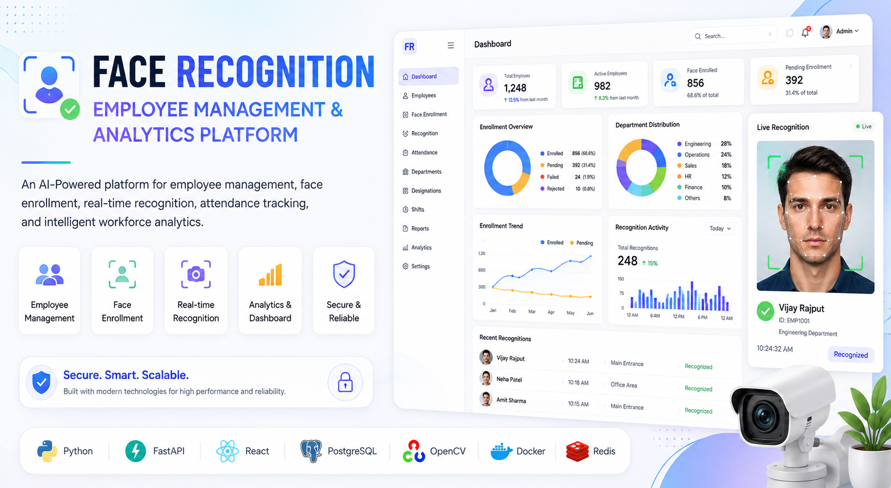

<br/>


<br/>

**An enterprise-grade, distributed AI-powered employee management and face recognition platform for secure video/camera biometric enrollment, real-time facial verification, dense vector similarity search, workforce analytics, and operational audit telemetry.**

[Explore Architecture](#-system-architecture) • [Quick Start](#-quick-start-with-docker) • [Local Setup](#-local-development-setup) • [API Documentation](#-api-documentation) • [Analytics Hub](#-dashboard-analytics-telemetry)

</div>

---

## 📑 Table of Contents

1. [Project Overview](#-project-overview)
2. [Key Features](#-key-features)
3. [Application Screenshots & Visual Tour](#-application-screenshots--visual-tour)
4. [System Architecture](#-system-architecture)
5. [AI / Computer Vision Pipeline](#-ai--computer-vision-pipeline)
6. [Milvus Vector Database Topology](#-milvus-vector-database-topology)
7. [Asynchronous Queue & Worker Architecture](#-asynchronous-queue--worker-architecture)
8. [Product Walkthrough & User Guide](#-product-walkthrough--user-guide)
9. [Dashboard Analytics & Telemetry](#-dashboard-analytics--telemetry)
10. [Technology Stack](#-technology-stack)
11. [Repository Structure](#-repository-structure)
12. [Prerequisites](#-prerequisites)
13. [Environment Configuration](#-environment-configuration)
14. [Quick Start with Docker](#-quick-start-with-docker)
15. [Local Development Setup](#-local-development-setup)
16. [API Documentation & Endpoints](#-api-documentation--endpoints)
17. [Database Schema & ER Relationships](#-database-schema--er-relationships)
18. [Troubleshooting & Diagnostics](#-troubleshooting--diagnostics)
19. [Security & Biometric Privacy](#-security--biometric-privacy)
20. [Performance & Scalability](#-performance--scalability)
21. [Production Deployment Recommendations](#-production-deployment-recommendations)
22. [Project Roadmap](#-project-roadmap)
23. [Author](#-author)

---

## 🌟 Project Overview

Traditional employee attendance and access management systems frequently suffer from buddy punching, physical credential loss, slow manual logbooks, and fragmented operational telemetry.

The **Face Recognition Employee Management & Analytics Platform** delivers an automated, enterprise-ready biometric platform built with **FastAPI**, **React 19**, **Milvus Vector DB**, **InsightFace (`buffalo_l`)**, and **RabbitMQ**.

### What Problems Does This Platform Solve?
- **Asynchronous Video Enrollment**: Ingests onboarding videos via message queues, parses high-quality facial frames using Laplacian variance and pose metrics, extracts 512-dimensional ArcFace embeddings, and indexes them into Milvus without blocking API threads.
- **Sub-10ms Approximate Nearest Neighbor (ANN) Recognition**: Executes real-time cosine similarity search across indexed employee galleries with high precision verification and spoof/outlier rejection.
- **Enterprise Multi-Attribute Governance**: Organizes employees by Departments, Designations, and Operational Shifts with dynamic grace-period configurations.
- **Live 6-Tier Intelligence Dashboard**: Tracks biometric health compliance, completion targets, spline-based enrollment trajectories, multi-dimensional vertical/pie distributions, workforce turnaround, and live audit feeds.

---

## ✨ Key Features

### 👥 Enterprise Workforce Governance
- **Full Employee Directory CRUD**: Profile management with unique employee codes, corporate email, phone, and joining date telemetry.
- **Organizational Taxonomies**: Dynamic Department allocation and Designation classifications.
- **Operational Shift Management**: Multi-shift scheduling with custom start times, end times, and configurable grace period minutes.
- **Multi-Attribute Global Filters**: Filter system metrics across department, shift, designation, and employment status simultaneously.

### 🧑‍💻 Asynchronous Biometric Face Enrollment
- **Video & Camera Ingestion**: Upload MP4/AVI enrollment recordings or capture live camera streams.
- **Automated Quality Filtering**: Laplacian variance blur filtering, illumination thresholds, and bounding box validation.
- **Centroid Vector Generation**: Generates averaged 512-D L2-normalized feature vectors across top candidate frames.
- **Resilient Background Processing**: RabbitMQ task queue (`face_enrollment_queue`) with persistent retry mechanisms and detailed failure telemetry.

### 📷 Real-Time Face Recognition Engine
- **InsightFace (`buffalo_l`)**: RetinaFace detection and ArcFace deep metric learning for high-accuracy feature extraction.
- **Milvus HNSW Vector Search**: ANN vector search using Cosine distance metric with sub-10ms query latency.
- **Live Verification Console**: Upload test photos or connect live webcams to receive instant match confidence scores, employee identity metadata, and latency diagnostics.
- **Threshold Security Guardrails**: Configurable verification boundary (default `0.45` / `0.60`) with automated access rejection for unknown faces.

### 📊 6-Tier Command & Telemetry Dashboard
1. **Summary KPI Strip**: Real-time cards for Total Workforce, Active Profiles, Face Enrolled, and Pending Action with export capabilities.
2. **Biometric Analytics Grid**:
   - **Face Enrollment Overview**: SVG linear-gradient donut chart with ambient glow, central rate readout, and 2x2 metric indicators.
   - **Face Enrollment Trend**: Fluid cubic Bezier curves, dual-tone gradient fills, interactive KPI badges, and floating crosshair tooltips.
   - **Enrollment Completion Target**: Semi-circular top-arch SVG goal gauge with 95% enterprise milestone marker and aging triage queue (`>7D`, `>30D`).
   - **Department Enrollment Health**: Interactive health filter tabs (`All`, `High ≥85%`, `Moderate 70–84%`, `Attention <70%`) with dual-tone compliance bars.
3. **Workforce Matrix**: Interactive **Vertical Column Bar Chart** and **Pie / Donut (%) Share Mode** across Departments, Shifts, and Designations with automated insight highlights.
4. **Growth & Turnaround**: Dual-mode trajectory curves and bi-directional **New Joiners vs Exits** turnaround analysis.
5. **AI Vector Cluster Telemetry**: Real-time Milvus cluster health, 512-D density telemetry, and Cosine similarity spectrum classification.
6. **Recent Biometric Audit Stream**: Live event feed with responsive **Grid View** and **List View** modes, filter tabs (`All`, `Completed`, `Issues`), and direct drilldown links.

---

## 🖼️ Application Screenshots & Visual Tour

<div align="center">

### 1. Executive 6-Tier Intelligence Dashboard
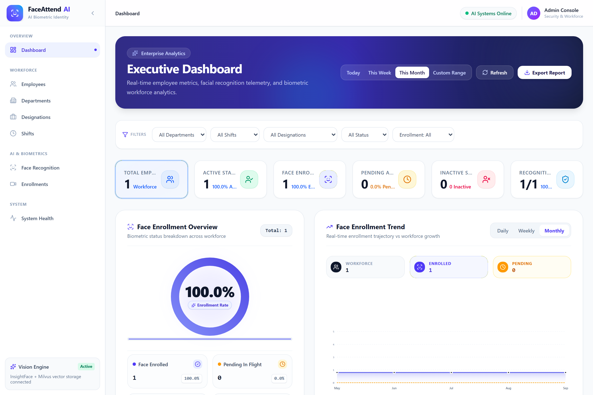
*High-density operational console featuring real-time enrollment trajectories, top-arch completion goals, vertical/pie dimension matrix, vector topology, and live audit telemetry.*

---

### 2. Employee Directory & Lifecycle Management

*Centralized workforce directory with multi-attribute filtering (Department, Shift, Designation, Status), instant search, and complete CRUD profile operations.*

---

### 3. Department Master Data & Capacity Tracker
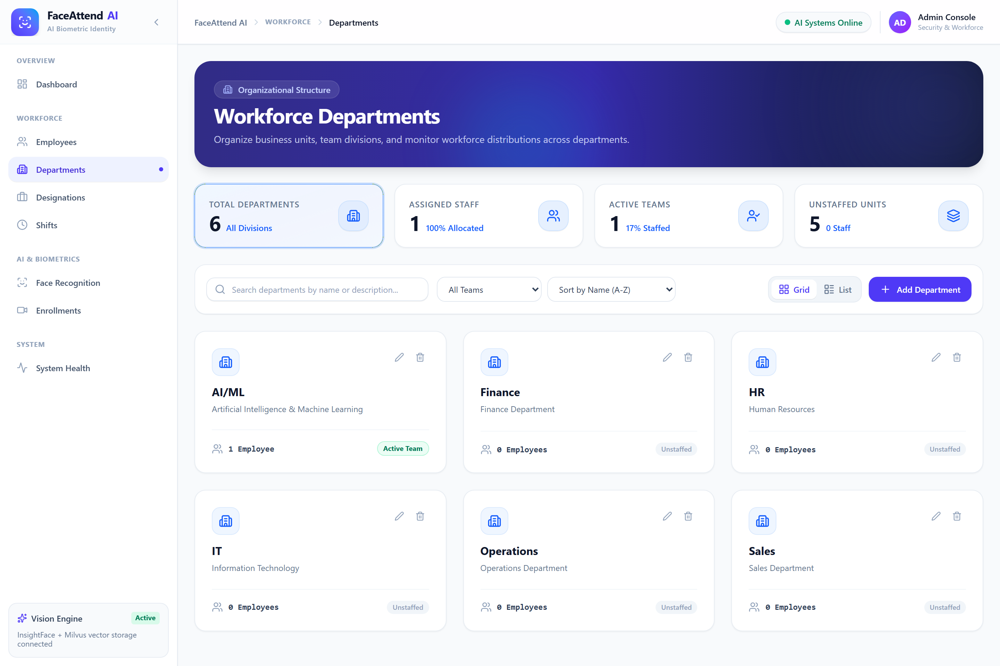
*Enterprise department taxonomy hub with real-time staff count aggregation and structural capacity allocation.*

---

### 4. Designation Taxonomy & Role Classifications
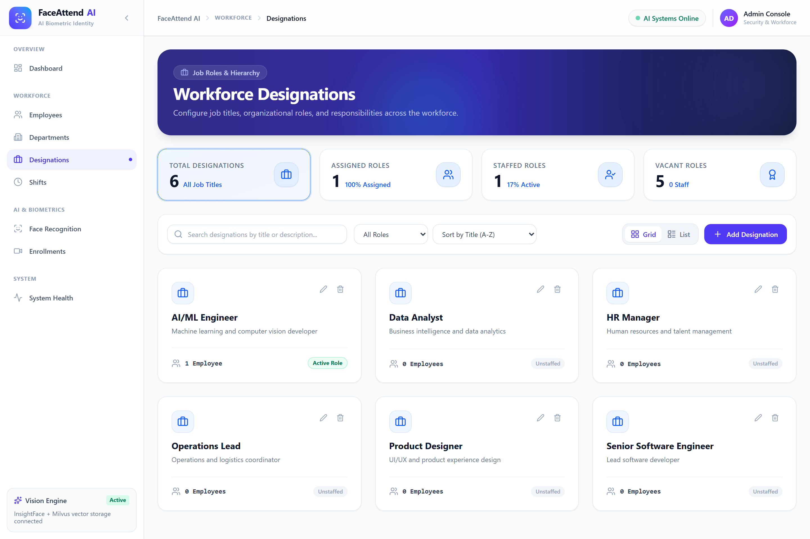
*Job role architecture and seniority classifications linked dynamically across all workforce analytics.*

---

### 5. Operational Shift Schedules & Grace Period Configurations
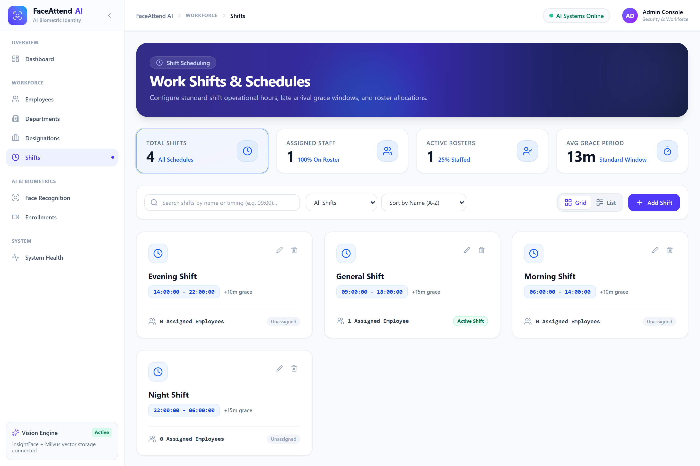
*Flexible multi-shift scheduling console with configurable start/end boundaries, overnight shift handling, and grace period minutes.*

---

### 6. Asynchronous Biometric Video Enrollment & Queue Monitor
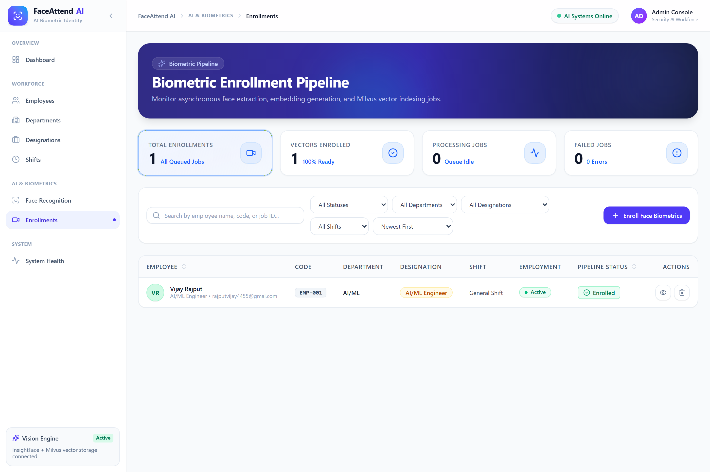
*Video ingestion pipeline monitor tracking asynchronous RabbitMQ worker jobs (`PENDING` ➔ `PROCESSING` ➔ `COMPLETED` / `FAILED`) with integrated video playback and retry controls.*

---

### 7. Real-Time AI Face Recognition & Live Verification Console
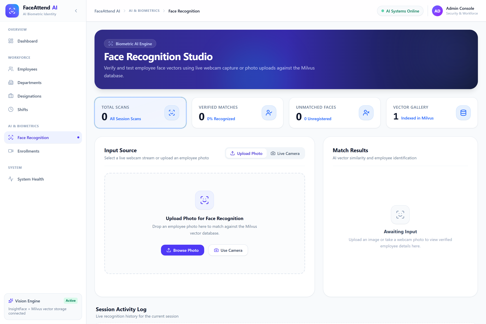
*Interactive testing station supporting image uploads and live webcam capture with bounding boxes, ArcFace cosine similarity scores, and latency diagnostics.*

---

### 8. Milvus Vector Database Cluster Health & Telemetry
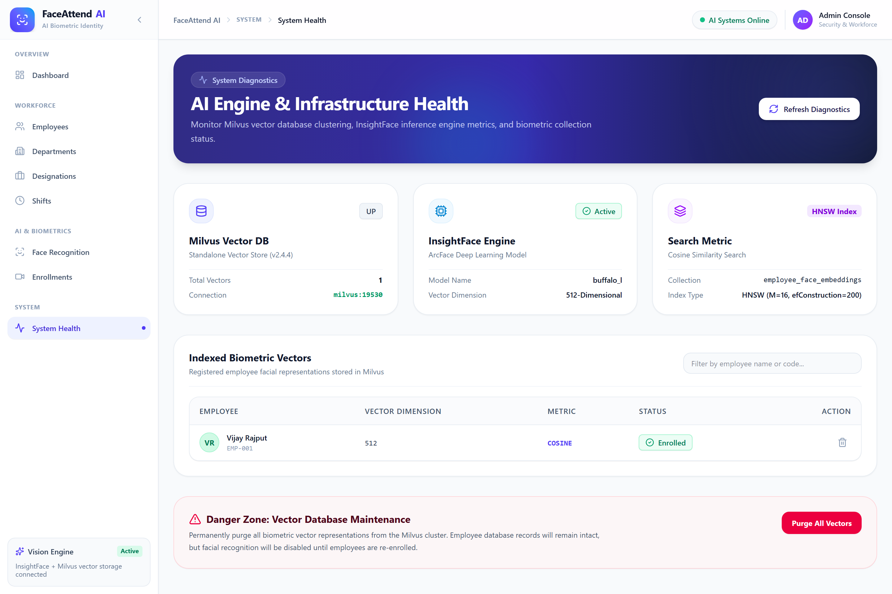
*Deep system telemetry monitor reporting Milvus HNSW vector collection state, ETCD metadata syncing, and microservice connectivity.*

</div>

---

## 🏗️ System Architecture

The platform is designed around a microservices-ready, event-driven decoupled architecture:

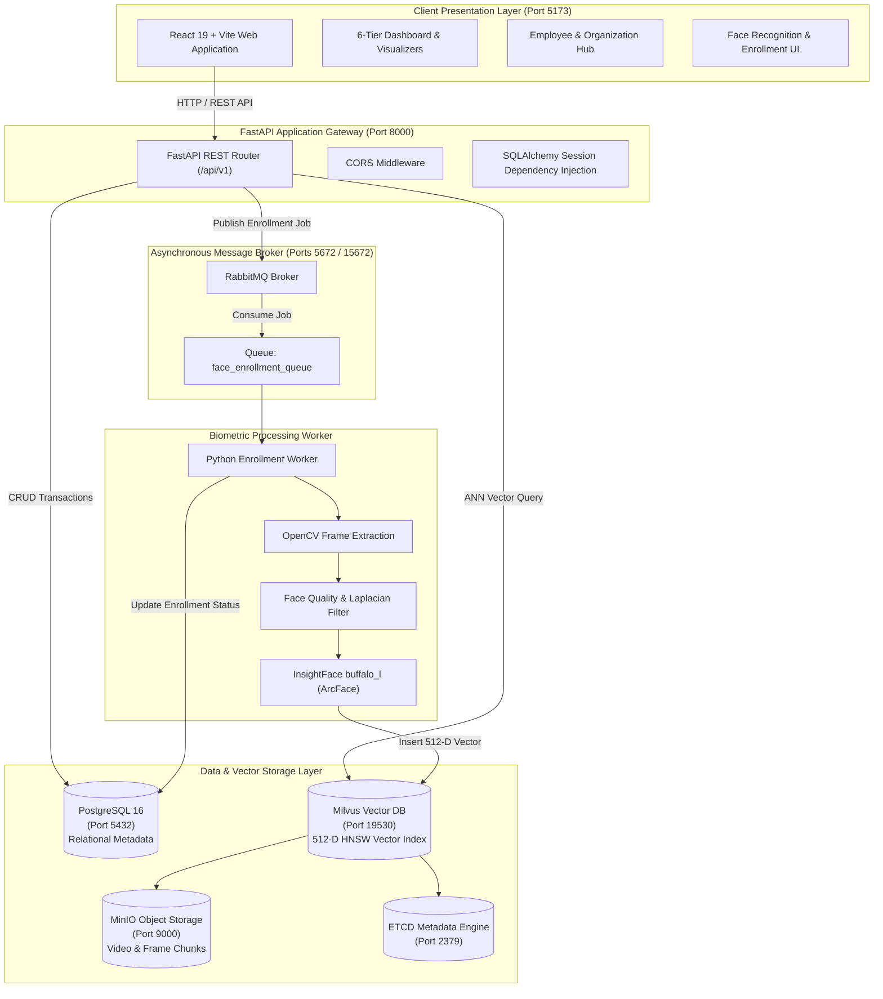
```mermaid
flowchart TB
    subgraph ClientLayer ["Client Presentation Layer (Port 5173)"]
        UI["React 19 + Vite Web Application"]
        Dashboard["6-Tier Dashboard & Visualizers"]
        Directory["Employee & Organization Hub"]
        TestingConsole["Face Recognition & Enrollment UI"]
    end

    subgraph APILayer ["FastAPI Application Gateway (Port 8000)"]
        Router["FastAPI REST Router (/api/v1)"]
        CORS["CORS Middleware"]
        DI["SQLAlchemy Session Dependency Injection"]
    end

    subgraph MessagingLayer ["Asynchronous Message Broker (Ports 5672 / 15672)"]
        RMQ["RabbitMQ Broker"]
        Queue["Queue: face_enrollment_queue"]
    end

    subgraph WorkerLayer ["Biometric Processing Worker"]
        Worker["Python Enrollment Worker"]
        CV["OpenCV Frame Extraction"]
        QA["Face Quality & Laplacian Filter"]
        Embedder["InsightFace buffalo_l (ArcFace)"]
    end

    subgraph StorageLayer ["Data & Vector Storage Layer"]
        Postgres[("PostgreSQL 16\n(Port 5432)\nRelational Metadata")]
        Milvus[("Milvus Vector DB\n(Port 19530)\n512-D HNSW Vector Index")]
        MinIO[("MinIO Object Storage\n(Port 9000)\nVideo & Frame Chunks")]
        ETCD[("ETCD Metadata Engine\n(Port 2379)")]
    end

    UI -->|"HTTP / REST API"| Router
    Router -->|"CRUD Transactions"| Postgres
    Router -->|"Publish Enrollment Job"| RMQ
    Router -->|"ANN Vector Query"| Milvus
    RMQ -->|"Consume Job"| Queue
    Queue --> Worker
    Worker --> CV
    CV --> QA
    QA --> Embedder
    Embedder -->|"Insert 512-D Vector"| Milvus
    Worker -->|"Update Enrollment Status"| Postgres
    Milvus --> MinIO
    Milvus --> ETCD
```

---

## 🧠 AI / Computer Vision Pipeline

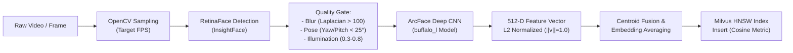
```mermaid
flowchart LR
    A["Raw Video / Frame"] --> B["OpenCV Sampling\n(Target FPS)"]
    B --> C["RetinaFace Detection\n(InsightFace)"]
    C --> D["Quality Gate:\n- Blur (Laplacian > 100)\n- Pose (Yaw/Pitch < 25°)\n- Illumination (0.3-0.8)"]
    D --> E["ArcFace Deep CNN\n(buffalo_l Model)"]
    E --> F["512-D Feature Vector\nL2 Normalized (||v||=1.0)"]
    F --> G["Centroid Fusion &\nEmbedding Averaging"]
    G --> H["Milvus HNSW Index\nInsert (Cosine Metric)"]
```

### Deep Learning Specifications:
- **Model Package**: InsightFace `buffalo_l` bundle.
- **Face Detector**: RetinaFace with multi-scale feature pyramids for robust localization.
- **Feature Extractor**: ArcFace (Additive Angular Margin Loss) generating rich $512$-dimensional compact embeddings.
- **Normalization**: Exact L2 unit hypersphere normalization ($\|\vec{v}\|_2 = 1.0$) enabling Dot Product to compute Cosine Similarity:
$$\text{Cosine Similarity}(\vec{u}, \vec{v}) = \vec{u} \cdot \vec{v} = \sum_{i=1}^{512} u_i v_i$$
- **Inference Hardware**: Configurable via `INSIGHTFACE_GPU_ID` (`-1` for high-throughput multi-thread CPU inference, `0` for NVIDIA CUDA GPU acceleration).

---

## ⚡ Milvus Vector Database Topology

The application utilizes **Milvus v2.4.4 Standalone** as its primary high-dimensional vector search engine:

| Attribute | Configuration | Description |
| :--- | :--- | :--- |
| **Collection Name** | `employee_face_embeddings` | Dedicated partition for registered workforce vectors |
| **Vector Dimension** | `512` | Matches InsightFace ArcFace output embedding dimension |
| **Metric Type** | `COSINE` | Optimized for directional similarity between unit vectors |
| **Index Algorithm** | `HNSW` | Hierarchical Navigable Small World proximity graph |
| **Index Parameters** | `M = 16`, `efConstruction = 200` | High-recall graph construction parameters |
| **Search Parameter** | `ef = 64` | Sub-5ms search accuracy parameter |
| **Consistency Level** | `Bounded` | Balanced read-your-writes distributed consistency |

---

## 📬 Asynchronous Queue & Worker Architecture

To prevent video encoding and deep learning operations from blocking user-facing API threads, enrollment runs via **RabbitMQ**:

1. **Client Upload**: Frontend uploads an onboarding video (`/api/v1/enrollments/upload-video`).
2. **Job Staging**: FastAPI persists an `employee_enrollments` record in `PENDING` status, saves the video file, and publishes an enrollment message to `face_enrollment_queue`.
3. **Worker Consumption**: `app.workers.enrollment_worker` receives the task:
   - Updates status to `PROCESSING`.
   - Samples candidate frames at regular intervals.
   - Evaluates frame quality (sharpness, pose angles, face count).
   - Generates and averages L2-normalized 512-D facial vectors.
   - Inserts vector into Milvus collection with reference `employee_id`.
   - Updates status to `COMPLETED` (or `FAILED` with specific error log).
4. **Resilience**: RabbitMQ utilizes durable queues and message acknowledgments (`basic_ack`), ensuring jobs are never lost during worker restarts.

---

## 📖 Product Walkthrough & User Guide

### 1. Department, Designation & Shift Setup
1. Navigate to **Departments** (`/departments`) ➔ Click **Create Department** (e.g. *Engineering*, *Operations*).
2. Navigate to **Designations** (`/designations`) ➔ Click **Create Designation** (e.g. *Senior AI Engineer*).
3. Navigate to **Shifts** (`/shifts`) ➔ Configure daily work schedules with start time, end time, and grace period minutes.

### 2. Employee Registration
1. Navigate to **Employees** (`/employees`) ➔ Click **Add Employee**.
2. Input employee code (`EMP-001`), first name, last name, email, phone, joining date, and select their assigned department, designation, and shift.
3. Save to generate the employee profile. The employee's biometric status is initialized as **Pending Action**.

### 3. Face Video Enrollment
1. Navigate to **Face Enrollment** (`/enrollments`) ➔ Click **Enroll Employee**.
2. Select the target employee from the searchable dropdown.
3. Upload an MP4/AVI face recording or record directly from your webcam.
4. The job is queued into RabbitMQ. The worker processes the video in the background and transitions the status from `PENDING` ➔ `PROCESSING` ➔ `COMPLETED`.

### 4. Real-Time Recognition & Verification
1. Navigate to **Face Recognition** (`/recognition`).
2. **Image Upload Mode**: Upload any photograph containing a face.
3. **Live Camera Mode**: Activate your webcam to capture live frames.
4. The system detects faces, extracts embeddings, searches Milvus, and renders:
   - Identified Employee Name and Code
   - Department, Designation, and Shift metadata
   - Cosine Similarity Confidence score (e.g. `98.4%`)
   - Inference & search latency breakdown

---

## 📊 Dashboard Analytics & Telemetry

```text
Dashboard Layout Structure:
├── Level 1: Global Filters & Summary KPIs (Total, Active, Enrolled, Pending)
├── Level 2: Face Enrollment Donut & Spline Trajectory Trend Chart (5:7 Grid)
├── Level 3: Radial Target Gauge & Department Enrollment Health Table (5:7 Grid)
├── Level 4: Workforce Allocation Matrix (Vertical Column Bar & Pie % Modes)
├── Level 5: Workforce Growth Curves & Recognition System AI Node Health
├── Level 6: Vector Database Topology & Cosine Similarity Spectrum
└── Level 7: Live Recent Biometric Activity & Audit Stream (Grid & List Views)
```

| Dashboard Visualizer | Implementation File | Key Metric / Functionality |
| :--- | :--- | :--- |
| **KPI Grid** | [`DashboardKpiGrid.jsx`](file:///c:/Users/VIJAY/Desktop/GitHub/face-recognition-attendance-system/frontend/src/features/dashboard/components/DashboardKpiGrid.jsx) | Total Workforce, Active Staff, Face Enrolled, Pending Action |
| **Enrollment Overview** | [`FaceEnrollmentOverviewDonut.jsx`](file:///c:/Users/VIJAY/Desktop/GitHub/face-recognition-attendance-system/frontend/src/features/dashboard/components/FaceEnrollmentOverviewDonut.jsx) | Glowing SVG multi-gradient donut with 2x2 interactive status telemetry |
| **Enrollment Trend** | [`FaceEnrollmentTrendChart.jsx`](file:///c:/Users/VIJAY/Desktop/GitHub/face-recognition-attendance-system/frontend/src/features/dashboard/components/FaceEnrollmentTrendChart.jsx) | Fluid cubic Bezier curves, dual-gradient fill, and interactive floating tooltip |
| **Target Completion** | [`EnrollmentCompletionTargetCard.jsx`](file:///c:/Users/VIJAY/Desktop/GitHub/face-recognition-attendance-system/frontend/src/features/dashboard/components/EnrollmentCompletionTargetCard.jsx) | Semicircular top-arch radial goal gauge (95% target) & aging triage queue |
| **Department Health** | [`DepartmentEnrollmentHealthTable.jsx`](file:///c:/Users/VIJAY/Desktop/GitHub/face-recognition-attendance-system/frontend/src/features/dashboard/components/DepartmentEnrollmentHealthTable.jsx) | Interactive tier filters (`All`, `≥85%`, `70-84%`, `<70%`) with gradient gauges |
| **Workforce Matrix** | [`WorkforceDistributionBarChart.jsx`](file:///c:/Users/VIJAY/Desktop/GitHub/face-recognition-attendance-system/frontend/src/features/dashboard/components/WorkforceDistributionBarChart.jsx) | Vertical column bars & Pie chart percentage modes across Departments/Shifts/Roles |
| **Growth & Turnaround**| [`EmployeeGrowthTrendChart.jsx`](file:///c:/Users/VIJAY/Desktop/GitHub/face-recognition-attendance-system/frontend/src/features/dashboard/components/EmployeeGrowthTrendChart.jsx) | Headcount growth trajectories vs bi-directional New Joiner / Exit bars |
| **AI Node Health** | [`RecognitionSystemHealthCard.jsx`](file:///c:/Users/VIJAY/Desktop/GitHub/face-recognition-attendance-system/frontend/src/features/dashboard/components/RecognitionSystemHealthCard.jsx) | InsightFace, Milvus DB, Gallery, and Cosine Matcher telemetry nodes |
| **Vector Topology** | [`MilvusVectorDistributionChart.jsx`](file:///c:/Users/VIJAY/Desktop/GitHub/face-recognition-attendance-system/frontend/src/features/dashboard/components/MilvusVectorDistributionChart.jsx) | 512-D collection vector density, HNSW configuration, and ANN latency stats |
| **Cosine Spectrum** | [`ConfidenceDistributionChart.jsx`](file:///c:/Users/VIJAY/Desktop/GitHub/face-recognition-attendance-system/frontend/src/features/dashboard/components/ConfidenceDistributionChart.jsx) | Similarity density spectrum histogram with 4 precision security tiers |
| **Recent Activity** | [`RecentActivityFeed.jsx`](file:///c:/Users/VIJAY/Desktop/GitHub/face-recognition-attendance-system/frontend/src/features/dashboard/components/RecentActivityFeed.jsx) | Full-width real-time audit feed with Grid / List view switcher & filter tabs |

---

## 💻 Technology Stack

### Backend & Core AI
- **Language**: Python 3.11+
- **API Framework**: FastAPI `0.138.0` with Starlette & AnyIO
- **Computer Vision**: OpenCV Headless (`opencv-python-headless >= 4.8.0.76`)
- **Deep Learning / Embeddings**: InsightFace `1.0.1`, ONNX Runtime `1.23.2`
- **Data Schemas & Validation**: Pydantic `2.13.4`, Pydantic-Settings `2.14.2`
- **ORM & Database Client**: SQLAlchemy `2.0.51`, Psycopg2-Binary `2.9.12`
- **Database Migrations**: Alembic `1.18.4`
- **Vector Database Client**: PyMilvus `3.0.0`
- **Message Broker Client**: Pika `1.4.1` (RabbitMQ protocol)
- **ASGI Web Server**: Uvicorn `0.49.0`

### Frontend Client
- **UI Library**: React `19.2.8` (Functional Components & Custom Hooks)
- **Build Tooling & Bundler**: Vite `8.2.1` with `@vitejs/plugin-react`
- **Styling Engine**: Tailwind CSS `v4.3.3` with `@tailwindcss/vite`
- **State & Server Cache Management**: TanStack React Query `v5.102.8`
- **Component Icons**: Lucide React `1.30.0`
- **HTTP Client**: Axios `1.19.0`
- **Linting & Code Quality**: Oxlint `1.75.0`

### Infrastructure & Orchestration
- **Containerization**: Docker Engine & Docker Compose
- **Vector Storage**: Milvus `v2.4.4` Standalone
- **Metadata Management**: ETCD `v3.5.5`
- **Object Storage**: MinIO `RELEASE.2023-03-20T20-16-18Z`
- **Message Broker**: RabbitMQ `3-management`
- **Relational Storage**: PostgreSQL `16`

---

## 📁 Repository Structure

```text
face-recognition-attendance-system/
├── app/                                # FastAPI Backend Application
│   ├── api/
│   │   └── v1/
│   │       ├── endpoints/              # Modular REST endpoint routers
│   │       │   ├── attendance_logs.py
│   │       │   ├── attendance_summaries.py
│   │       │   ├── dashboard.py        # Real-time analytics aggregation endpoints
│   │       │   ├── department.py       # Department master data CRUD
│   │       │   ├── designation.py      # Designation taxonomy CRUD
│   │       │   ├── employee.py         # Employee profile management CRUD
│   │       │   ├── enrollment.py       # Video upload & enrollment status
│   │       │   ├── milvus_admin.py     # Milvus vector cluster administration
│   │       │   ├── recognition.py      # Face verification & matching
│   │       │   └── shift.py            # Shift schedule configuration
│   │       └── router.py               # Aggregated v1 API router
│   ├── core/
│   │   ├── config.py                   # Pydantic environment settings
│   │   ├── database.py                 # SQLAlchemy engine & session factory
│   │   ├── logger.py                   # Structured console & file logger
│   │   └── startup.py                  # Seed initial departments/shifts on start
│   ├── models/                         # SQLAlchemy ORM declarative models
│   │   ├── attendance_log.py
│   │   ├── attendance_summary.py
│   │   ├── department.py
│   │   ├── designation.py
│   │   ├── employee.py
│   │   ├── employee_enrollment.py
│   │   ├── face_profile.py
│   │   └── shift.py
│   ├── repositories/                   # Data access layer & SQL queries
│   │   ├── dashboard_repo.py           # Optimized analytics aggregation queries
│   │   └── employee_repo.py
│   ├── schemas/                        # Pydantic request/response models
│   │   ├── dashboard.py
│   │   ├── department.py
│   │   ├── designation.py
│   │   ├── employee.py
│   │   ├── enrollment.py
│   │   ├── recognition.py
│   │   └── shift.py
│   ├── services/                       # Business logic & AI/ML integration
│   │   ├── dashboard_service.py
│   │   ├── embedding_service.py        # Centroid embedding averaging
│   │   ├── face_quality_service.py     # Blur, pose, illumination evaluation
│   │   ├── frame_extraction_service.py # OpenCV video frame sampling
│   │   ├── insightface_service.py      # ArcFace & RetinaFace model wrapper
│   │   ├── milvus_service.py           # Milvus collection management & ANN search
│   │   ├── rabbitmq_service.py         # Queue declaration & message publisher
│   │   └── recognition_service.py      # Face verification pipeline
│   ├── workers/                        # Asynchronous background workers
│   │   └── enrollment_worker.py        # Video enrollment consumer
│   └── main.py                         # FastAPI entrypoint with CORS & Lifespan
├── database/                           # Database migrations & schemas
│   └── migrations/
│       ├── env.py                      # Alembic migration environment
│       └── versions/                   # Version migration revisions
├── deploy/                             # Docker Compose deployment manifests
│   ├── docker-compose.dev.yml          # Development overlay
│   ├── docker-compose.local.yml        # Local all-in-one stack
│   ├── docker-compose.prod.yml         # Production base configuration
│   └── docker-compose.yml              # Base service definitions
├── docker/                             # Container build recipes
│   ├── Dockerfile.api                  # FastAPI backend image
│   ├── Dockerfile.frontend             # Production Nginx frontend image
│   ├── Dockerfile.frontend.dev         # Hot-reloading Vite dev image
│   └── Dockerfile.worker               # Python background worker image
├── docs/                               # Documentation, architecture & assets
│   ├── architecture/                   # Architecture diagrams & schematics
│   ├── demo/                           # Demos and walkthrough assets
│   └── screenshots/                    # Application UI captures
├── face_storage/                       # Persistent biometric storage
│   ├── frames/                         # Extracted frame candidate images
│   └── videos/                         # Ingested enrollment video files
├── frontend/                           # React 19 Frontend Web Application
│   ├── src/
│   │   ├── api/                        # Axios API client integrations
│   │   ├── components/                 # Shared UI design system components
│   │   ├── context/                    # Navigation & Application Context
│   │   ├── features/                   # Domain-driven feature modules
│   │   │   ├── dashboard/              # 6-tier dashboard & custom charts
│   │   │   ├── departments/            # Department management page
│   │   │   ├── designations/           # Designation management page
│   │   │   ├── employees/              # Employee directory & CRUD
│   │   │   ├── enrollments/            # Video enrollment monitor & video player
│   │   │   ├── recognition/            # Real-time face test console
│   │   │   ├── shifts/                 # Shift configuration page
│   │   │   └── system-health/          # Milvus vector cluster diagnostics
│   │   ├── App.jsx                     # Root application routing container
│   │   └── main.jsx                    # React entrypoint
│   ├── package.json                    # Frontend dependencies & scripts
│   └── vite.config.js                  # Vite configuration & dev proxy
├── alembic.ini                         # Alembic database migration config
├── requirements.txt                    # Pinned Python backend dependencies
└── README.md                           # Master project documentation
```

---

## 📋 Prerequisites

### Required on Local Host (If running without Docker)
- **Python**: `3.11` or higher (`python --version`)
- **Node.js**: `v18.0.0` or higher (`node --version`)
- **npm**: `v9.0.0` or higher (`npm --version`)
- **PostgreSQL**: `v15` or `v16` running on port `5432`
- **RabbitMQ**: `v3.12+` with Management Plugin on ports `5672` / `15672`
- **Milvus**: `v2.4+` standalone running on port `19530`

### Required for Containerized Setup
- **Docker Engine**: `v24.0+` (`docker --version`)
- **Docker Compose**: `v2.20+` (`docker compose version`)

---

## ⚙️ Environment Configuration

Create a `.env` file in the project root by copying `.env.example`:

```bash
cp .env.example .env
```

### Environment Variables Reference:

| Variable | Description | Default / Example Value |
| :--- | :--- | :--- |
| `APP_NAME` | Application display name | `"Face Recognition Attendance System"` |
| `APP_ENV` | Application runtime environment | `development` (or `production`) |
| `LOG_LEVEL` | Console logging granularity | `INFO` (or `DEBUG`, `WARNING`) |
| `POSTGRES_HOST` | PostgreSQL hostname | `postgres` (Docker) or `localhost` (Local) |
| `POSTGRES_PORT` | PostgreSQL port | `5432` |
| `POSTGRES_DB` | Database name | `face_db` |
| `POSTGRES_USER` | Database user | `face_user` |
| `POSTGRES_PASSWORD` | Database password | `face_password` |
| `RABBITMQ_HOST` | RabbitMQ hostname | `rabbitmq` (Docker) or `localhost` (Local) |
| `RABBITMQ_PORT` | RabbitMQ AMQP port | `5672` |
| `RABBITMQ_USER` | RabbitMQ username | `admin` |
| `RABBITMQ_PASSWORD` | RabbitMQ password | `adminpassword` |
| `MILVUS_URI` | Milvus connection endpoint | `http://milvus:19530` or `http://localhost:19530` |
| `MILVUS_COLLECTION` | Face vectors collection name | `employee_face_embeddings` |
| `MILVUS_DIMENSION` | Facial vector length | `512` |
| `MILVUS_METRIC_TYPE`| Similarity distance metric | `COSINE` |
| `MILVUS_INDEX_TYPE` | ANN index algorithm | `HNSW` |
| `MINIO_ACCESS_KEY` | MinIO storage access key | `minioadmin` |
| `MINIO_SECRET_KEY` | MinIO storage secret key | `minioadmin` |
| `INSIGHTFACE_GPU_ID`| GPU Device ID (-1 for CPU) | `-1` |

---

## 🐳 Quick Start with Docker

The fastest way to launch the complete end-to-end stack is using Docker Compose.

### 1. Build and Start All Services

```bash
docker compose -f deploy/docker-compose.local.yml up --build -d
```

### 2. Verify Running Containers

```bash
docker compose -f deploy/docker-compose.local.yml ps
```

*Expected running services:*
- `frontend` (React 19 Vite app on port `5173`)
- `api` (FastAPI backend with auto-migrations on port `8000`)
- `worker` (Asynchronous Python enrollment worker)
- `postgres` (PostgreSQL 16 database on port `5432`)
- `rabbitmq` (RabbitMQ Message Broker on ports `5672` / `15672`)
- `milvus` (Milvus Standalone Vector DB on port `19530`)
- `etcd` (Milvus metadata store on port `2379`)
- `minio` (Object storage on port `9000`)

### 3. Access Web Endpoints

- **🖥️ Frontend Web Application**: [http://localhost:5173](http://localhost:5173)
- **📖 Interactive API Docs (Swagger UI)**: [http://localhost:8000/docs](http://localhost:8000/docs)
- **🐰 RabbitMQ Management Panel**: [http://localhost:15672](http://localhost:15672) *(Credentials: `admin` / `adminpassword`)*
- **🗄️ MinIO Storage Console**: [http://localhost:9000](http://localhost:9000) *(Credentials: `minioadmin` / `minioadmin`)*

### 4. Stop Services

```bash
# Stop all containers
docker compose -f deploy/docker-compose.local.yml down

# Stop and delete persistent data volumes (CAUTION: Deletes database and vector data)
docker compose -f deploy/docker-compose.local.yml down -v
```

---

## 🛠️ Local Development Setup

If developing without Docker containers, follow this step-by-step procedure:

### Step 1 — Clone the Repository
```bash
git clone https://github.com/VijayRajput4455/face-recognition-attendance-system.git
cd face-recognition-attendance-system
```

### Step 2 — Configure Environment
```bash
cp .env.example .env
# Edit .env and change POSTGRES_HOST=localhost, RABBITMQ_HOST=localhost, MILVUS_URI=http://localhost:19530
```

### Step 3 — Setup Python Virtual Environment & Dependencies
```bash
# Create Python virtual environment
python -m venv .venv

# Activate on Windows:
.venv\Scripts\activate
# Activate on Linux/macOS:
source .venv/bin/activate

# Install Python requirements
pip install -r requirements.txt
```

### Step 4 — Run Database Migrations
```bash
alembic upgrade head
```

### Step 5 — Launch FastAPI Backend Server
```bash
uvicorn app.main:app --host 0.0.0.0 --port 8000 --reload
```

### Step 6 — Start Background Video Worker (In a separate terminal)
```bash
# Activate virtual environment
source .venv/bin/activate   # or .venv\Scripts\activate on Windows

# Start enrollment worker
python -m app.workers.enrollment_worker
```

### Step 7 — Setup and Run React Frontend
```bash
cd frontend

# Install node dependencies
npm install

# Start Vite development server
npm run dev
```

Open [http://localhost:5173](http://localhost:5173) in your browser.

---

## 📡 API Documentation & Endpoints

FastAPI automatically generates interactive OpenAPI/Swagger documentation accessible at **`http://localhost:8000/docs`**.

### Primary API Routes:

#### 👥 Employees (`/api/v1/employees`)
- `GET /api/v1/employees` — List all employees with multi-attribute filtering (department, shift, designation, status)
- `POST /api/v1/employees` — Create a new employee profile
- `POST /api/v1/employees/bulk` — **[NEW]** Bulk create employees from JSON list with smart name-to-ID foreign key resolution
- `POST /api/v1/employees/bulk-upload` — **[NEW]** Bulk import employees from CSV file with column validation and row error reporting
- `GET /api/v1/employees/{id}` — Fetch detailed employee record by UUID
- `PUT /api/v1/employees/{id}` — Update employee details, department, shift, or designation
- `DELETE /api/v1/employees/{id}` — Delete employee profile

#### 🏢 Departments (`/api/v1/departments`)
- `GET /api/v1/departments` — List all organization departments
- `POST /api/v1/departments` — Create a new department
- `POST /api/v1/departments/bulk` — **[NEW]** Bulk create departments from JSON list
- `POST /api/v1/departments/bulk-upload` — **[NEW]** Bulk import departments from CSV file (`department_name`, `description`)
- `GET /api/v1/departments/{id}` — Fetch department by ID
- `PUT /api/v1/departments/{id}` — Update department name
- `DELETE /api/v1/departments/{id}` — Remove department

#### 💼 Designations (`/api/v1/designations`)
- `GET /api/v1/designations` — List all job designations
- `POST /api/v1/designations` — Create a new job designation
- `POST /api/v1/designations/bulk` — **[NEW]** Bulk create designations from JSON list
- `POST /api/v1/designations/bulk-upload` — **[NEW]** Bulk import designations from CSV file (`designation_name`, `description`)
- `PUT /api/v1/designations/{id}` — Update designation name
- `DELETE /api/v1/designations/{id}` — Remove designation

#### ⏰ Shifts (`/api/v1/shifts`)
- `GET /api/v1/shifts` — List all operational shifts
- `POST /api/v1/shifts` — Create shift (name, start time, end time, grace minutes)
- `POST /api/v1/shifts/bulk` — **[NEW]** Bulk create shifts from JSON list
- `POST /api/v1/shifts/bulk-upload` — **[NEW]** Bulk import shifts from CSV file (`shift_name`, `start_time`, `end_time`, `grace_minutes`)
- `PUT /api/v1/shifts/{id}` — Update shift timings
- `DELETE /api/v1/shifts/{id}` — Remove shift

#### 🧑‍💻 Enrollments (`/api/v1/enrollments`)
- `GET /api/v1/enrollments` — List biometric enrollment jobs and status
- `POST /api/v1/enrollments/upload-video` — Upload employee onboarding video for background processing

- `GET /api/v1/enrollments/{id}` — Fetch status of a specific enrollment job
- `POST /api/v1/enrollments/{id}/retry` — Retry a failed enrollment video processing job

#### 📷 Face Recognition (`/api/v1/recognition`)
- `POST /api/v1/recognition/verify-image` — Upload an image for real-time face detection, embedding generation, and Milvus ANN identification

#### 📊 Dashboard Analytics (`/api/v1/dashboard`)
- `GET /api/v1/dashboard/summary` — High-level workforce counts, face enrollment rate, and pending metrics
- `GET /api/v1/dashboard/face-enrollment-overview` — Enrolled, pending, failed, and not-started breakdown
- `GET /api/v1/dashboard/face-enrollment-trend` — Trajectory timeline data points (daily, weekly, monthly)
- `GET /api/v1/dashboard/departments-analytics` — Department headcount and compliance rates
- `GET /api/v1/dashboard/shifts-analytics` — Shift distribution and enrolled ratios
- `GET /api/v1/dashboard/designations-analytics` — Headcount per job role
- `GET /api/v1/dashboard/employee-growth` — Net workforce growth and turnaround points (7d, 30d, 3m, 6m, 1y)
- `GET /api/v1/dashboard/recent-activity` — Recent face enrollment and verification event stream

#### 🩺 Milvus Diagnostics (`/api/v1/milvus`)
- `GET /api/v1/milvus/health` — Vector cluster connection and status diagnostics
- `GET /api/v1/milvus/collection-stats` — Vector count and index state

---

## 🗄️ Database Schema & ER Relationships

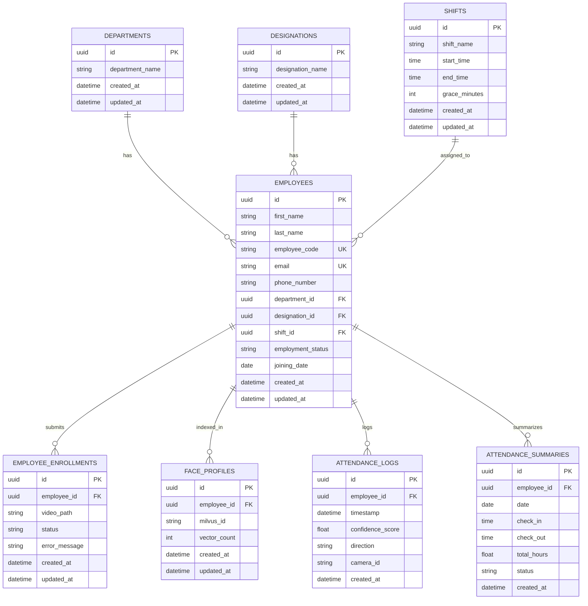
```mermaid
erDiagram
    DEPARTMENTS ||--o{ EMPLOYEES : "has"
    DESIGNATIONS ||--o{ EMPLOYEES : "has"
    SHIFTS ||--o{ EMPLOYEES : "assigned_to"
    EMPLOYEES ||--o{ EMPLOYEE_ENROLLMENTS : "submits"
    EMPLOYEES ||--o{ FACE_PROFILES : "indexed_in"
    EMPLOYEES ||--o{ ATTENDANCE_LOGS : "logs"
    EMPLOYEES ||--o{ ATTENDANCE_SUMMARIES : "summarizes"

    DEPARTMENTS {
        uuid id PK
        string department_name
        datetime created_at
        datetime updated_at
    }

    DESIGNATIONS {
        uuid id PK
        string designation_name
        datetime created_at
        datetime updated_at
    }

    SHIFTS {
        uuid id PK
        string shift_name
        time start_time
        time end_time
        int grace_minutes
        datetime created_at
        datetime updated_at
    }

    EMPLOYEES {
        uuid id PK
        string first_name
        string last_name
        string employee_code UK
        string email UK
        string phone_number
        uuid department_id FK
        uuid designation_id FK
        uuid shift_id FK
        string employment_status
        date joining_date
        datetime created_at
        datetime updated_at
    }

    EMPLOYEE_ENROLLMENTS {
        uuid id PK
        uuid employee_id FK
        string video_path
        string status
        string error_message
        datetime created_at
        datetime updated_at
    }

    FACE_PROFILES {
        uuid id PK
        uuid employee_id FK
        string milvus_id
        int vector_count
        datetime created_at
        datetime updated_at
    }

    ATTENDANCE_LOGS {
        uuid id PK
        uuid employee_id FK
        datetime timestamp
        float confidence_score
        string direction
        string camera_id
        datetime created_at
    }

    ATTENDANCE_SUMMARIES {
        uuid id PK
        uuid employee_id FK
        date date
        time check_in
        time check_out
        float total_hours
        string status
        datetime created_at
    }
```

---

## 🔍 Troubleshooting & Diagnostics

### 1. Database Connection Failure
- Verify PostgreSQL container is healthy:
  ```bash
  docker compose -f deploy/docker-compose.local.yml ps postgres
  docker compose -f deploy/docker-compose.local.yml logs postgres
  ```
- Ensure `POSTGRES_USER`, `POSTGRES_PASSWORD`, and `POSTGRES_DB` in `.env` match database initialization credentials.

### 2. RabbitMQ Queue Connection Issues
- Check broker status and ports:
  ```bash
  docker compose -f deploy/docker-compose.local.yml logs rabbitmq
  ```
- Access RabbitMQ web interface at `http://localhost:15672` to verify `face_enrollment_queue` is declared and active.

### 3. Milvus Vector DB Offline / Degraded
- Milvus requires both `etcd` and `minio` containers to be running:
  ```bash
  docker compose -f deploy/docker-compose.local.yml ps etcd minio milvus
  ```
- Test Milvus health via backend API endpoint:
  ```bash
  curl http://localhost:8000/api/v1/milvus/health
  ```

### 4. Camera Access Denied in Browser
- Browsers require `localhost` or an `HTTPS` connection to grant access to webcam hardware (`navigator.mediaDevices.getUserMedia`). Ensure camera permissions are enabled in your browser settings.

---

## 🔒 Security & Biometric Privacy

1. **Embedding One-Way Cryptographic Integrity**:
   - The platform stores numerical $512$-dimensional floating point vectors rather than reconstructing raw facial photography. Mathematical face embeddings cannot be reverse-engineered back into original photographic imagery.
2. **Environment Variable Hygiene**:
   - Sensitive credentials (database passwords, message broker keys, and access tokens) are isolated in `.env` files that are strictly excluded from version control via `.gitignore`.
3. **Parametric SQL Injection Defense**:
   - All relational operations utilize SQLAlchemy 2.0 parameterized queries and ORM mappings, eliminating raw SQL concatenation vulnerabilities.
4. **CORS Configuration**:
   - Cross-Origin Resource Sharing is controlled in `app/main.py` and configurable per environment.

---

## 🚀 Performance & Scalability

- **HNSW Approximate Nearest Neighbor Search**: Logarithmic $O(\log N)$ search complexity enables scaling to tens of thousands of employee identities with sub-10ms response times.
- **Asynchronous Task Offloading**: High-compute video processing (video decoding, quality calculation, ONNX inference) is isolated inside dedicated background worker processes.
- **Stateless API Architecture**: The FastAPI application layer maintains zero local session state, allowing horizontal multi-replica container scaling behind an Nginx or Kubernetes ingress load balancer.
- **Centroid Vector Representation**: Condenses hundreds of candidate video frames into an accurate single centroid vector per employee, keeping Milvus memory usage minimal.

---

## 🗺️ Project Roadmap

- [x] **FastAPI Backend Architecture**: Full modular REST API endpoints for employees, departments, shifts, designations, and enrollments.
- [x] **Milvus Vector Integration**: 512-D ArcFace embedding ingestion, HNSW indexing, and Cosine ANN matching.
- [x] **RabbitMQ Task Queue**: Asynchronous video frame extraction and background enrollment worker.
- [x] **InsightFace AI Engine**: Deep metric learning integration with blur and pose quality gating.
- [x] **React 19 Frontend**: Enterprise dashboard with 6-tier analytics, real-time recognition testing, and employee directory CRUD.
- [x] **Docker Compose Architecture**: Multi-container local orchestration (FastAPI, React, Worker, Postgres, RabbitMQ, Milvus, MinIO, ETCD).
- [ ] **Live RTSP IP Camera Streaming**: Direct NVR/RTSP video feed ingestion with multi-camera stream worker pipelines.
- [ ] **Automated PDF/CSV Report Generation**: Scheduled automated workforce attendance exports.
- [ ] **JWT Role-Based Access Control (RBAC)**: Multi-tenant administrative authentication with audit logging.

---

## 👨‍💻 Author

<div align="center">

### **Vijay Rajput**
*AI/ML Engineer • Computer Vision • Deep Learning Systems*

[](https://github.com/VijayRajput4455)
[](https://github.com/VijayRajput4455/face-recognition-attendance-system)

</div>

---

## 📄 License

Information regarding software licensing will be added. Please refer to the repository for updates.
